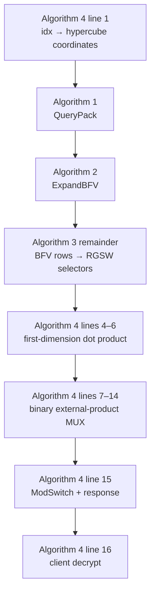

# OnionPIRv2 论文与代码深度阅读指南

> 本文结合 2021 年 OnionPIR 论文、2025 年 OnionPIRv2 论文与当前仓库源码，解释协议演进、密码学原语、端到端架构、关键实现、数据布局、论文与实现的语义对齐，以及当前代码能够和不能够证明的性质。

## 0. 文档信息与结论边界

### 0.1 阅读材料

- 2021 本地副本：<a href="/Users/little_sun/Downloads/2021-1081.pdf">OnionPIR: Response Efficient Single-Server PIR</a>，Muhammad Haris Mughees、Hao Chen、Ling Ren。
- 2025 本地副本：<a href="/Users/little_sun/Downloads/2025-1142.pdf">OnionPIRv2: Efficient Single-Server PIR</a>，Yue Chen、Ling Ren。
- 代码仓库：当前工作区。
- 审阅快照：Git commit <code>1676dd7441db56a97867c4ef7efde3f7f14d07bf</code>。

本文中的论文页码均指 PDF 页码，而不是论文正文自行印刷的页码。代码链接使用相对于本文档的仓库路径；两篇论文链接是用户提供的本机副本，若本文档随仓库迁移，需要改为公共论文 URL 或新的相对路径。

### 0.2 证据标记

为了避免把推断写成事实，本文采用三种标记：

- **证据**：源码、测试、配置或论文原文直接支持。
- **推断**：由多项证据共同导出的最合理解释。
- **未知**：当前仓库无法确定，需要外部版本、实验输出或系统集成信息。

### 0.3 一句话结论

当前仓库高置信度实现了 2025 论文所描述的 OnionPIRv2 无状态单次查询主链：

索引坐标化 → 单 BFV 查询打包 → BFV 展开 → RGSW 选择器重建 → 首维矩阵乘 → 高维外积 MUX → 模数切换 → 位打包响应 → 客户端解密

本文聚焦两篇论文的无状态 OnionPIR 主链；2021 论文另行提出的 stateful 扩展不纳入本文讨论。查询及密钥材料的 seed compression 只进入通信量公式，没有形成真实的 seed 编解码和网络传输路径。

严格来说，README 只声明 “OnionPIR version 2”，仓库中没有把某个 commit 固定到论文 artifact 的元数据。因此本文将它表述为“与 2025 OnionPIRv2 论文高度对齐的实现”，而不把仓库版本和论文评测版本视为逐字节相同。

### 高层导航

全文按精确编号包含第 0–20 节和附录 A–C；下面是把相邻章节合并后的十条阅读主线：

1. 排名式总览与推荐阅读路线
2. 2021 → 2025 的协议演进
3. 密码学与代数背景
4. 仓库架构、参数与数据布局
5. 从索引到明文的端到端代码走读
6. Paper ↔ implementation semantic alignment
7. 论文技巧、实现省略项与工程扩展
8. 正确性不变量、测试与性能边界
9. 安全性、并发与生产化边界
10. 仓库漂移、复现实验与阅读索引

## 1. 排名式总览

| 排名 | 综合判断 | 置信度 | 依据 |
|---|---|---:|---|
| 1 | 当前代码的中心是 2025 Algorithm 1–4 的完整计算流水线 | 高 | 客户端打包、服务端展开、RGSW 重建、两阶段 DB 选择、ModSwitch 和解密均存在连续调用链 |
| 2 | 2021 算法是技术前身，而不是当前代码的逐行规格 | 高 | 2025 明确用 ModSwitch 替代 plaintext splitting，并把四元高维选择改为二元选择 |
| 3 | seed 压缩和请求/密钥通信量主要是模型值 | 高 | 测试直接传递完整 C++ 对象；仅 response 有真实 bitstream codec |
| 4 | 性能关键路径围绕内存带宽和数域布局优化，而非协议层并发 | 高 | coefficient-major DB、tile NTT、AVX-512 matmul、scratch reuse 均存在；代码明确假设 external product 单线程 |
| 5 | 代码不能独立证明论文给出的安全位数和论文表格性能 | 高 | 无 LWE estimator、无固定 benchmark artifact、无真实 query/key wire bytes |

## 2. 推荐阅读路线

### 2.1 先看清论文算法的嵌套关系

不要按论文编号机械地读成“Algorithm 1、2、3、4 各走一遍”。真正的在线执行顺序由 Algorithm 4 统领：它在第 2 行调用 Algorithm 1，在第 3 行调用 Algorithm 3，而 Algorithm 3 内部先执行 Algorithm 2。

因此，阅读代码的主顺序应是：

~~~text
Algorithm 4 line 1
  → Algorithm 1 QueryPack
  → Algorithm 2 ExpandBFV
  → Algorithm 3 RGSW completion
  → Algorithm 4 first dimension
  → Algorithm 4 remaining dimensions
  → Algorithm 4 ModSwitch / response / decrypt
~~~

2021 Algorithm 1–3 只用于解释这些步骤的技术来源和被替代设计。第一次追代码时以 2025 Algorithm 4 为主轴，走完整条链后再回看第 3.1 和 9.3 节。

### 2.2 严格按照论文算法逐步阅读 codebase

下面是一条可以实际照着打开文件的路线。每一步的“过关问题”都能回答后，再进入下一步。

#### 第 0 步：先用端到端测试建立调用骨架

- **读代码：** <a href="../src/tests/test_pir.cpp#L4"><code>PirTest::test_pir</code></a>。
- **只看：** 参数、数据库初始化、key setup、query、server、response、decrypt 的先后顺序。
- **暂时跳过：** 每个 helper 的数学细节和性能 timer。
- **过关问题：** 能否写出 <code>fast_generate_query → make_query → save/load → decrypt_mod_q</code>，并指出客户端与服务端的边界？

这一文件是代码版 Algorithm 4 的外层实验框架，也是后续迷路时应返回的“地图”。

#### 第 1 步：补齐论文默认省略的参数与对象模型

- **读代码：** <a href="../src/includes/database_constants.h#L39">编译期参数</a> → <a href="../src/includes/pir.h#L10"><code>PirParams</code></a> → <a href="../src/includes/rlwe.h#L12"><code>RlweCt</code></a>。
- **记录参数：** <code>n</code>、<code>K</code>、<code>q</code>、<code>t</code>、<code>q'</code>、<code>N0</code>、<code>Nrest</code>、<code>L_EP</code>、<code>L_KEY</code>、<code>L_KS</code>。
- **记录布局：** 一个 <code>RlweCt</code> 有 <code>c0/c1</code> 两个 polynomial；每个 polynomial 是 <code>K</code> 个连续的 <code>n</code>-coefficient limb。
- **过关问题：** 能否说明 <code>L_EP</code>、<code>L_KEY</code> 和 <code>L_KS</code> 分别控制哪种 decomposition，而不是把三个 <code>ℓ</code> 混为一谈？

#### 第 2 步：读 Algorithm 4 之前的 setup

- **读代码：** <a href="../src/tests/test_pir.cpp#L8">参数与 DB 初始化</a>、<a href="../src/tests/test_pir.cpp#L34">key setup</a>、<a href="../src/server.cpp#L50"><code>gen_data</code></a>。
- **客户端生成：** secret key、ExpandBFV 使用的 <code>BvGaloisKeys</code>，以及 QueryUnpack 使用的 <code>RGSW(s)</code>。
- **服务端保存：** 按 <code>client_id</code> 索引的 evaluation keys；DB 被预先 NTT，并重排成 coefficient-major matrix storage。
- **过关问题：** 能否分别指出“哪个 key 用于 automorphism 后 key switching”和“哪个 key 用于补全 RGSW 下半行”？

这一步不是 Algorithm 4 的在线行号，但缺少它，Algorithm 2 和 Algorithm 3 都无法执行。

#### 第 3 步：Algorithm 4 line 1——把线性索引变成坐标

- **读代码：** <a href="../src/client.cpp#L39"><code>PirClient::get_query_indices</code></a>。
- **输入：** plaintext index <code>pt_idx</code>。
- **输出：** <code>[i0, b1, ..., b(d-1)]</code>；<code>i0</code> 是首维位置，后续元素是 binary selectors。
- **实现扩展：** 论文描述规则 hypercube；代码还处理 <code>Nrest</code> 不是二次幂的 complete-but-not-perfect tree。
- **过关问题：** 能否手算一个 index 的 <code>col_idx</code>、<code>row_idx</code> 和 selector bits，并解释第一个 ragged-tree bit 为什么特殊？

#### 第 4 步：Algorithm 1 前半——写入首维 one-hot

- **读代码：** <a href="../src/client.cpp#L90"><code>fast_generate_query</code></a>，重点看 <a href="../src/client.cpp#L98">坐标与 capacity</a>、<a href="../src/client.cpp#L103"><code>1/capacity</code></a> 和 <a href="../src/client.cpp#L105"><code>BitRev</code></a>。
- **动作：** 先生成 BFV encryption of zero，再把 one-hot message 的缩放值直接加到 <code>c0[BitRev(i0)]</code>。
- **输入 → 输出：** <code>i0 → packed RlweCt</code> 中的一个首维有效槽。
- **过关问题：** 为什么代码不是“构造完整 plaintext 再调用 BFV encrypt”，但仍与论文 QueryPack 等价？为什么必须乘 <code>capacity⁻¹</code>？

#### 第 5 步：Algorithm 1 后半——写入高维 RGSW gadget rows

- **读代码：** <a href="../src/client.cpp#L137"><code>add_gsw_to_query</code></a>。
- **动作：** 对每个为 1 的高维 selector，把 <code>L_EP</code> 个 MSB-first gadget powers 写入对应的 bit-reversed packed coefficients。
- **关键布局：** 前 <code>N0</code> 个 expanded outputs 属于 BFV first-dimension vector；后面每连续 <code>L_EP</code> 个 outputs 属于一个 RGSW selector 的上半行。
- **输出：** 整个请求仍然只是一个 coefficient-form、full-q <code>RlweCt</code>。
- **过关问题：** 给定 dimension <code>i</code> 和 gadget row <code>k</code>，能否写出其 packed coefficient 位置 <code>N0+(i-1)L_EP+k</code>？

读到这里，2025 Algorithm 1 完成。

#### 第 6 步：Algorithm 2——ExpandBFV

- **读代码：** <a href="../src/server.cpp#L612"><code>fast_expand_qry</code></a> → <a href="../src/utils.cpp#L56">automorphism</a> → <a href="../src/bv_keyswitch.cpp#L477"><code>bv_apply_galois_inplace</code></a>。
- **动作：** 服务器在 1-based heap 中逐层执行 automorphism、BV key switching、add/sub 与 negacyclic shift。
- **剪枝：** <a href="../src/server.cpp#L662">只遍历仍可能产生前 <code>u</code> 个有效 leaves 的子树</a>。
- **输入 → 输出：** 一个 packed BFV → <code>u=N0+L_EP(d-1)</code> 个 constant BFV ciphertexts。
- **状态：** 这一函数中的 ciphertext 保持 coefficient form、K-limb、full q。
- **过关问题：** 为什么 leaf 顺序必须和客户端 <code>BitRev</code> 一致？如果删除 BV key switching，automorphism 后的 ciphertext 为什么不能继续当作原密钥下的密文？

读到这里，2025 Algorithm 2 完成。

#### 第 7 步：Algorithm 3——把 expanded rows 解释成 BFV 与 RGSW

- **读代码：** <a href="../src/server.cpp#L720"><code>make_query</code> 的 selector reconstruction</a> → <a href="../src/gsw.cpp#L302"><code>GSWEval::query_to_gsw</code></a>。
- **拆分：** <code>query_vector[0:N0]</code> 是首维 BFV selection vector；其余 outputs 每 <code>L_EP</code> 个组成一个 selector 的 top half。
- **补全：** top half 直接复制并转 NTT；bottom half 通过这些 rows 与客户端上传的 <code>RGSW(s)</code> 做 external product 得到。
- **输出：** <code>N0</code> 个 BFV ciphertexts，加 <code>d-1</code> 个 <code>2L_EP × 2</code> 的 NTT-form <code>GSWCt</code>。
- **过关问题：** 为什么输入 selector 只有 <code>L_EP</code> rows，输出却有 <code>2L_EP</code> rows？为什么 completion key 使用 <code>L_KEY</code> 而输出 shape 仍由 <code>L_EP</code> 决定？

读到这里，2025 Algorithm 3 完成，也就是 Algorithm 4 line 3 完成。

#### 第 8 步：Algorithm 4 lines 4–6——首维 dot product

- **读代码：** <a href="../src/server.cpp#L151"><code>prep_query</code></a> → <a href="../src/server.cpp#L246"><code>evaluate_first_dim</code></a> → <a href="../src/matrix.cpp#L104"><code>level_mat_mat</code></a>。
- **论文矩阵：** 对每个 NTT coefficient，可看成 <code>A[Nrest×N0] · B[N0×2] → C[Nrest×2]</code>。
- **实现状态变化：** BFV query 从 coefficient form 转为 NTT form；结果经 <code>inter_to_cts</code> 回到 coefficient-form <code>RlweCt</code> vector。
- **composite 路径：** <code>k1_comp</code> 把逻辑 58-bit <code>q</code> 临时拆成两个 29-bit matrix multiply，再 CRT-compose。
- **输入 → 输出：** <code>N0</code> 个 BFV selectors + 全 DB → <code>Nrest</code> 个 encrypted candidates。
- **过关问题：** 为什么这里是 standard integer matrix multiplication，而不是逐条调用通用 BFV plaintext multiplication？

#### 第 9 步：Algorithm 4 lines 7–14——逐层 external-product MUX

- **读代码：** <a href="../src/server.cpp#L510"><code>evaluate_other_dim</code></a> → <a href="../src/server.cpp#L546"><code>ext_prod_mux</code></a> → <a href="../src/gsw.cpp#L111"><code>external_product</code></a>。
- **每次选择：** 对原始 candidates <code>x</code>、<code>y</code> 计算 <code>x+b(y-x)</code>；源码原地把 <code>y</code> 复用为差值和 external-product scratch。
- **候选数变化：** 每个 selector 消掉一层，通常从 <code>m</code> 变成 <code>ceil(m/2)</code>；ragged first level 单独处理缺失 sibling。
- **domain 变化：** external product 输出 NTT form，level boundary 前执行 INTT 回 coefficient form。
- **输出：** 一个仍在 full-q 下的 BFV ciphertext。
- **过关问题：** 能否分别证明 <code>b=0</code> 输出原始 <code>x</code>、<code>b=1</code> 输出原始 <code>y</code>，并指出哪一行发生 gadget decomposition？

#### 第 10 步：Algorithm 4 line 15——ModSwitch 与响应编码

- **读代码：** <a href="../src/server.cpp#L751"><code>make_query</code> post-processing</a> → <a href="../src/server.cpp#L835"><code>mod_switch_inplace</code></a> → <a href="../src/server.cpp#L767"><code>save_resp_to_stream</code></a>。
- **数值变化：** full-q coefficient 被 centered rescale 到 <code>small_q</code>；K=2 路径先 drop 一个 RNS limb，再执行 single-limb rescale。
- **布局变化：** <code>RlweCt(coeff/full-q) → RlweCt(coeff/small-q) → c0 后 c1、LSB-first bitstream</code>。
- **过关问题：** 为什么 ModSwitch 必须放在所有 homomorphic selection 之后？文档中的 response bytes 为什么是实测 codec 大小，而 query bytes 只是公式估计？

#### 第 11 步：Algorithm 4 line 16——客户端恢复明文

- **读代码：** <a href="../src/client.cpp#L269"><code>load_resp_from_stream</code></a> → <a href="../src/client.cpp#L308"><code>decrypt_mod_q</code></a>。
- **动作：** 按相同位序还原 small-q ciphertext；把 secret key 重编码到 <code>small_q</code>，计算 <code>c0+c1s</code>，再用 <code>round(phase·t/small_q)</code> 恢复 plaintext。
- **oracle：** <a href="../src/tests/test_pir.cpp#L70">测试直接读取原始 plaintext</a>，并在 <a href="../src/tests/test_pir.cpp#L77">此处比较</a>；直接读取不是 PIR 协议的一部分。
- **过关问题：** 能否区分“客户端解密协议路径”和“测试为了验证正确性而直接查 DB”的两条路径？

#### 第 12 步：用分层测试锁定每个算法边界

按依赖顺序阅读或运行：

1. <a href="../src/tests/test_fast_expand.cpp"><code>fast_expand</code></a>：Algorithm 2。
2. <a href="../src/tests/test_bv_keyswitch.cpp"><code>bv_ks</code></a>：Algorithm 2 的 Subs/key-switch primitive。
3. <a href="../src/tests/test_ext_prod.cpp"><code>ext_prod</code></a>：Algorithm 3 completion 与 Algorithm 4 MUX 的核心 primitive；当前强证据主要覆盖 K=1。
4. <a href="../src/tests/test_fst_dim.cpp"><code>fst_dim</code></a>：Algorithm 4 lines 4–6。
5. <a href="../src/tests/test_mod_switch.cpp"><code>mod_switch</code></a>：Algorithm 4 line 15。
6. <a href="../src/tests/test_pir.cpp"><code>pir</code></a>：Algorithm 4 全链。

最终应能独立写出下面这条数据状态账本：

~~~text
idx
  → coordinates [i0, b1, ...]
  → packed BFV            (coefficient / full-q)
  → expanded BFV rows     (coefficient / full-q)
  → BFV vector + RGSW     (BFV coefficient; RGSW NTT / full-q)
  → first-dim candidates  (coefficient / full-q)
  → one selected BFV      (coefficient / full-q)
  → switched response     (coefficient / small-q)
  → byte stream           (c0 then c1 / LSB-first)
  → plaintext             (mod t)
~~~

### 2.3 完成论文主路线后的工程复读

不要按文件名逐个通读，也不要一开始陷入 NTT、AVX-512 或 128-bit reduction。推荐按下面七个阶段推进；每一阶段都有一个明确的“完成标志”。

| 阶段 | 先读什么 | 本阶段只关注什么 | 完成标志 |
|---:|---|---|---|
| 0. 找入口 | <a href="../run.py#L30">run.py</a> → <a href="../src/main.cpp#L6">main.cpp</a> → <a href="../src/tests/run_test.cpp#L3">run_test.cpp</a> | config 如何进入编译、test 名如何进入 dispatcher | 能说明 <code>python3 run.py -t pir -c k1_comp</code> 最终调用谁 |
| 1. 建立对象模型 | <a href="../src/includes/database_constants.h">database_constants.h</a> → <a href="../src/includes/pir.h">pir.h</a> → <a href="../src/pir.cpp">pir.cpp</a> → <a href="../src/includes/rlwe.h">rlwe.h</a> | <code>n/K/q/t/q'</code>、<code>L_EP/L_KEY/L_KS</code>、DB shape、<code>RlweCt</code> 布局 | 能画出一个 ciphertext 的两个 polynomial、K 个 limb 和 n 个 coefficient |
| 2. 先追完整时序 | <a href="../src/tests/test_pir.cpp#L34">test_pir.cpp</a> → <a href="../src/client.cpp#L90">fast_generate_query</a> → <a href="../src/server.cpp#L712">make_query</a> | setup、query、server evaluation、response、decrypt 的先后关系 | 能不看 helper 写出“index → plaintext”的调用链 |
| 3. 拆 QueryPack/Unpack | <a href="../src/client.cpp#L39">get_query_indices</a> → <a href="../src/client.cpp#L90">fast_generate_query</a> → <a href="../src/server.cpp#L612">fast_expand_qry</a> → <a href="../src/bv_keyswitch.cpp#L477">bv_apply_galois_inplace</a> → <a href="../src/gsw.cpp#L302">query_to_gsw</a> | one-hot/gadget 槽位、BitRev、ExpandBFV、automorphism、RGSW completion | 能把 2025 Algorithm 1–3 逐步指到具体函数和输出 layout |
| 4. 追数据库收缩 | <a href="../src/server.cpp#L50">gen_data</a> → <a href="../src/server.cpp#L151">prep_query</a> → <a href="../src/server.cpp#L246">evaluate_first_dim</a> → <a href="../src/matrix.cpp#L104">level_mat_mat</a> | NTT DB layout、query transpose、首维 matrix shape、composite split | 能解释为什么首维是 DB×query matrix multiplication，而不是通用 BFV multiply 循环 |
| 5. 追高维与响应 | <a href="../src/server.cpp#L510">evaluate_other_dim</a> → <a href="../src/server.cpp#L546">ext_prod_mux</a> → <a href="../src/gsw.cpp#L111">external_product</a> → <a href="../src/server.cpp#L835">mod_switch_inplace</a> → <a href="../src/server.cpp#L767">save_resp_to_stream</a> → <a href="../src/client.cpp#L269">load/decrypt</a> | <code>x+b(y-x)</code>、candidate 减半、full-q→small-q、bit packing | 能解释一个 selector 如何把两个 encrypted candidates 合成一个，并最终恢复 plaintext |
| 6. 用测试反证理解 | <a href="../src/tests/run_test.cpp#L3">测试 dispatcher</a>、<a href="../src/tests/test_pir.cpp">端到端测试</a>、<a href="../src/tests/test_ext_prod.cpp">external product</a>、<a href="../src/tests/test_fast_expand.cpp">query expansion</a>、<a href="../src/tests/test_mod_switch.cpp">ModSwitch</a> | 每个 test 实际断言什么，哪些只是打印诊断 | 能为主链每个阶段指出至少一个 oracle，并说出尚未覆盖的 K=2/serialization 边界 |

可以把最短调用路线压缩成：

~~~text
run.py → main → test_pir
  → PirClient::fast_generate_query
  → PirServer::make_query
      → fast_expand_qry
      → GSWEval::query_to_gsw
      → evaluate_first_dim
      → evaluate_other_dim / ext_prod_mux
      → mod_switch_inplace
  → save/load response
  → PirClient::decrypt_mod_q
~~~

读完这条主路线后，再按第 19 节的“三遍法”复读：第一遍只追控制流，第二遍给每条边标注 domain/layout，第三遍才进入算术 kernel 与性能优化。

### 2.4 如果想优化性能

重点阅读：

- <a href="../src/server.cpp#L50">DB tile streaming 与布局转换</a>
- <a href="../src/server.cpp#L151">query transpose</a>
- <a href="../src/matrix.cpp#L17">overflow-aware chunked reduction</a>
- <a href="../src/matrix.cpp#L104">AVX-512 dispatch</a>
- <a href="../src/matrix.cpp#L215">AVX-512 32×32→64 kernel</a>
- <a href="../src/includes/gsw.h#L17">external-product scratch reuse</a>
- <a href="../src/bv_keyswitch.cpp#L280">Galois scratch reuse</a>

## 3. 两篇论文之间的协议演进

### 3.1 2021 OnionPIR 的核心思想

2021 论文试图同时降低单服务器 PIR 的响应开销与服务端计算成本。它的关键思想不是直接进行高噪声的 BFV ciphertext-ciphertext multiplication，而是组合 BFV 和 RGSW：

- 首维使用 BFV 加密选择向量，与 plaintext DB 做乘加。
- 后续维度使用 RGSW 选择位与 BFV 中间结果做 external product。
- 所有维度的查询向量被压入一个 BFV ciphertext，再由服务器展开。

论文的 warm-up protocol 原本让每一维都携带 RGSW query，并让每轮输出保持 BFV；完整 OnionPIR 则把第一维改成 BFV query vector、把第一维设得稍大，并只在后续维使用 RGSW。这一不对称结构让线性 DB 工作集中在较易优化的 ciphertext-plaintext dot product，同时用 external product 控制跨维度的噪声增长。

2021 stateless 协议包含三个正式编号算法：

| PDF 页 | 实体 | 作用 |
|---:|---|---|
| 5 | Algorithm 1：QueryPack | 把首维每个 bit 的两个分解分量，以及高维每 bit 的 gadget 行打包进一个 BFV |
| 6 | Algorithm 2：QueryUnpack | 展开 BFV，并用 RGSW(-s) 补全 RGSW 行 |
| 7 | Algorithm 3：OnionPIR Protocol | 首维 DecompMul，后续四元维度使用 external product |

其首维还依赖 Figure 4 的三个未编号 primitive：

1. <code>DecompPlain</code>：把 plaintext 拆成两个约为 <code>log(t)/2</code> bit 的部分。
2. <code>DecompEncrypt</code>：把选择 bit 编码为两个 BFV ciphertext。
3. <code>DecompMul</code>：对上述两部分执行点积。

### 3.2 2025 OnionPIRv2 改变了什么

2025 论文保留“首维 BFV，后续维 RGSW external product”的骨架，但对协议做了几处关键重构：

1. **首维 plaintext splitting 被 ModSwitch 替代。**
   首维直接做标准 plaintext×BFV 矩阵乘；最终响应统一缩到较小模数。

2. **后续维度从大小 4 改成二元维。**
   每层使用一个 RGSW bit 选择前半或后半，选择式改写为 <code>b(y-x)+x</code>，只需一次 external product。

3. **QueryPack 的槽位语义改变。**
   首维直接打包 <code>N0</code> 个 one-hot 常数；每个高维 bit 只打包 RGSW 的上半 <code>ℓ</code> 行。

4. **QueryUnpack 改用 RGSW(s)。**
   展开得到 RGSW 上半行后，以 RGSW(s) 通过 external product 生成下半行。

5. **加入现代 FHE 与工程优化。**
   包括 ModSwitch、composite NTT、BV key switching、signed decomposition、两套 gadget 参数、tree pruning、standard matmul、HEXL 等。这里列的是论文设计；当前 K=2 GSW 路径的 unsigned MP 差异见第 4.5 节。

2025 论文包含四个正式编号算法：

| PDF 页 | 实体 | 当前代码角色 |
|---:|---|---|
| 6 | Algorithm 1：QueryPack | <code>PirClient::fast_generate_query</code> |
| 7 | Algorithm 2：ExpandBFV | <code>PirServer::fast_expand_qry</code> |
| 7 | Algorithm 3：QueryUnpack | <code>fast_expand_qry + GSWEval::query_to_gsw</code> |
| 11 | Algorithm 4：OnionPIR Protocol | <code>PirServer::make_query</code> 端到端调度 |

### 3.3 关于 theorem

两篇论文都没有正式编号的 Theorem、Lemma 或 Proposition。不能人为构造“Theorem 1 → 某函数”的映射。

2025 论文中的 Chinese Remainder Theorem 是通用数学原语，不是论文自有 theorem。对应实现包括：

- <a href="../src/pir.cpp#L11">PirParams::init_composite_rns</a>
- <a href="../src/utils.cpp#L221">utils::crt_combine</a>
- <a href="../src/server.cpp#L445">PirServer::inter_to_cts_composite</a>

论文中的 correctness、noise 和 security 结论以正文论述或参数估计出现。代码实现可提供行为证据，但不是形式化证明。

## 4. 密码学与代数背景

本节只介绍理解代码所需的最小数学表面。

### 4.1 环与符号

代码使用二次幂多项式次数 <code>n</code>，在 negacyclic ring

R = Z[x] / (xⁿ + 1)

上运算。

为避免论文符号冲突，本文使用：

- <code>n</code>：多项式次数，代码中是 <code>DBConsts::PolyDegree</code>。
- <code>M</code>：数据库 plaintext 数量，代码中是 <code>num_pt_</code>。
- <code>N0</code>：数据库首维长度，代码中是 <code>fst_dim_sz_</code>。
- <code>Nrest</code>：首维处理后剩余候选数，代码中是 <code>other_dim_sz</code>。
- <code>q</code> 或 <code>Q</code>：ciphertext modulus。
- <code>t</code>：plaintext modulus。
- <code>q'</code>：最终响应使用的 small modulus。
- <code>K</code>：RNS limb 数。
- <code>ℓEP</code>、<code>ℓKEY</code>、<code>ℓKS</code>：三种 gadget 长度。

### 4.2 BFV/RLWE

2025 论文写作：

(c0, c1) = (-as + e + Δm, a),　Δ = floor(q/t)

解密计算 <code>c0 + c1·s</code>，再按 <code>t/q</code> 缩放和取整。

当前代码的 fresh zero 约定是：

c1 = a,　c0 = -(as + e)

消息通过向 <code>c0</code> 加 <code>Δm</code> 注入，所以 phase 为 <code>Δm-e</code>。误差符号与论文写法相反，但对称 Gaussian 下分布等价，解密逻辑相同。直接实现见 <a href="../src/rlwe.cpp#L17">rlwe.cpp:17</a>。

### 4.3 RGSW 与 gadget matrix

令 gadget vector 为：

g = (B^(ℓ-1), B^(ℓ-2), ..., 1)

并定义：

G = I₂ ⊗ g

RGSW 对消息 <code>m</code> 的加密写成：

C = Z + mG

其中 <code>Z</code> 的每一行是 BFV(0)。在代码中，<code>GSWCt</code> 是扁平化的 <code>2ℓ × 2</code> 多项式矩阵，见 <a href="../src/includes/gsw.h#L8">gsw.h:8</a>。

### 4.4 External product

External product 的核心是：

ExternalProduct(C, ct) = Decomp(ct) · C

若 <code>C</code> 加密 bit <code>b</code>，而 <code>ct</code> 加密消息 <code>m</code>，输出仍是 BFV ciphertext，并加密 <code>b·m</code>。

代码路径：

1. 把 BFV 的 <code>c0/c1</code> 各分解成 <code>ℓ</code> 个 gadget digits。
2. 把 <code>2ℓ</code> 行变到 NTT domain。
3. 执行 <code>[1×2ℓ] · [2ℓ×2]</code> polynomial matrix multiplication。
4. 输出 NTT-form <code>RlweCt</code>。

主要实现位于 <a href="../src/gsw.cpp#L111">GSWEval::external_product</a>。

### 4.5 Signed decomposition 与三套参数

2025 论文强调 signed gadget decomposition：digit 位于 <code>[-B/2, B/2)</code>，比 unsigned digit 的无穷范数更小，因而降低噪声。

代码实际维护三种独立长度：

| 参数 | 用途 | 代码位置 |
|---|---|---|
| <code>L_EP</code> | 高维 DB 选择器的 external product | <a href="../src/includes/database_constants.h#L53">database_constants.h</a> |
| <code>L_KEY</code> | QueryUnpack 中借助 RGSW(s) 补全选择器 | <a href="../src/server.cpp#L31">server.cpp:31</a> |
| <code>L_KS</code> | ExpandBFV 的 BV key switching | <a href="../src/includes/bv_keyswitch.h#L31">bv_keyswitch.h:31</a> |

这解释了服务器中两个 <code>GSWEval</code> 实例：

- <code>key_gsw_</code> 使用 <code>L_KEY</code>，只服务 QueryUnpack。
- <code>data_gsw_</code> 使用 <code>L_EP</code>，服务数据库高维 MUX。

这里有一个 config-dependent 差异：K=1 external-product 路径 <a href="../src/gsw.cpp#L237">decomp_rlwe_single_mod</a> 使用 signed digits；K=2 external-product 路径 <a href="../src/gsw.cpp#L171">decomp_rlwe_mp</a> 先 CRT-compose，再提取 <code>[0,B)</code> 的 unsigned digits。BV key switching 的 K=1 和 K=2 路径则都使用 signed decomposition。故“signed gadget decomposition 已实现”对默认 K=1/composite 路径成立，对 K=2 data external product 只能标为部分对齐。

### 4.6 Automorphism 与 BV key switching

ExpandBFV 需要对 ciphertext 应用 ring automorphism <code>σk</code>。automorphism 会把 ciphertext 从原密钥关系移到 <code>σk(s)</code>，因此还必须 key-switch 回原密钥 <code>s</code>。

代码采用 2025 论文指定的 BV-style key switching：

- coefficient permutation：<a href="../src/utils.cpp#L56">utils::automorphism_coeff</a>
- key generation：<a href="../src/bv_keyswitch.cpp#L222">gen_bv_ks_key</a>
- application：<a href="../src/bv_keyswitch.cpp#L477">bv_apply_galois_inplace</a>

每个 expansion level 有一个 automorphism key；每个 key 有 <code>L_KS</code> 个 RLWE rows。

### 4.7 NTT、RNS 与 composite modulus

NTT 把 polynomial multiplication 变成逐系数乘法。当前实现直接使用 Intel HEXL。

代码支持两种容易混淆的多模表示：

1. **真正的 K=2 RNS/MP 路径**
   ciphertext 的每个 polynomial 存两个 limb；gadget decomposition 会先 CRT-compose 成最多 128-bit 的整数。

2. **K=1 logical composite modulus 路径**
   流水线把 <code>q=q1·q2</code> 当成一个 logical modulus。只在首维 matmul 前临时 split 为两个 29-bit limb，以使用快速 32×32→64 运算；之后 CRT-compose 回 logical q。

第二种正是 2025 论文所说的 composite NTT：既让首维使用小整数 matmul，又避免后续 external product 反复 CRT 往返。

### 4.8 Modulus switching

协议完成所有 homomorphic computation 后，将 ciphertext 从 <code>Q</code> 缩到 <code>q'</code>：

c' = round(c · q' / Q)

实现先把 residue 转成以 0 为中心的有符号代表，再做舍入，见 <a href="../src/utils.cpp#L427">utils::rescale</a>。这样信号和噪声同步缩放，响应位宽显著下降。

## 5. 仓库架构

### 5.1 模块职责

| 模块 | 主要职责 | 核心类型/函数 |
|---|---|---|
| <code>pir.*</code> | 参数生成、数据库 shape、CRT 表 | <code>PirParams</code> |
| <code>client.*</code> | 密钥、坐标、QueryPack、响应解码 | <code>PirClient</code> |
| <code>server.*</code> | DB 预处理与完整在线协议 | <code>PirServer</code> |
| <code>rlwe.*</code> | BFV/RLWE keygen、encrypt、decrypt、加减、NTT | <code>RlweCt/RlweSk/RlwePt</code> |
| <code>gsw.*</code> | RGSW encryption、decomposition、external product | <code>GSWCt/GSWEval</code> |
| <code>bv_keyswitch.*</code> | ExpandBFV 的 BV Galois key switching | <code>BvGaloisKeys</code> |
| <code>matrix.*</code> | 首维 dense matmul 与 SIMD kernel | <code>level_mat_mat</code> |
| <code>utils.*</code> | NTT cache、CRT、采样、bit reverse、rescale | <code>utils</code> namespace |
| <code>logging.*</code> | benchmark sections、warmup 和统计 | <code>TimerLogger</code> |
| <code>tests/*</code> | 功能、数值与性能测试入口 | <code>PirTest</code> |

### 5.2 对象关系

~~~mermaid
classDiagram
    class PirParams {
      rns_mods
      plain_mod
      small_q
      fst_dim_sz
      num_dims
      L_EP
      L_KEY
    }

    class PirClient {
      client_id
      RlweSk rlwe_sk
      fast_generate_query()
      create_bv_galois_keys()
      generate_gsw_from_key()
      decrypt_mod_q()
    }

    class PirServer {
      client_bv_galois_keys
      client_gsw_keys
      DB buffers
      GSWEval key_gsw
      GSWEval data_gsw
      make_query()
    }

    class GSWEval {
      l
      base_log2
      external_product()
      query_to_gsw()
    }

    PirClient --> PirParams
    PirServer --> PirParams
    PirServer --> GSWEval
    PirClient --> PirServer : keys + packed query
~~~

### 5.3 生命周期

~~~mermaid
sequenceDiagram
    participant C as PirClient
    participant S as PirServer
    participant G as GSWEval/BVKS
    participant D as DB/Matrix kernel

    Note over C,S: Offline / per-client setup
    C->>S: BvGaloisKeys
    C->>S: RGSW(s)

    Note over S,D: Database setup
    S->>D: random plaintexts → NTT → coeff-major DB

    Note over C,S: Online query
    C->>C: idx → coordinates / bits
    C->>C: QueryPack → one RlweCt
    C->>S: packed RlweCt object
    S->>G: ExpandBFV via automorphism + BV KS
    S->>G: reconstruct RGSW selectors
    S->>D: first-dimension DB × BFV matrix multiply
    S->>G: higher-dimension external-product MUX tree
    S->>S: ModSwitch to small_q
    S-->>C: bit-packed response stream
    C->>C: unpack + decrypt
~~~

这里的 “send” 只是协议语义。当前测试中，key/query 是 C++ 对象直接传递；只有 response 真正经过字节流。

## 6. 参数、数据库 shape 与计算规模

### 6.1 编译期配置

参数由 <a href="../src/includes/database_constants.h">database_constants.h</a> 在编译期选定：

| 配置 | n | K / q | L_EP | L_KEY | L_KS | TREE_HEIGHT | PlainMod bits | small-q bits | 首维策略 |
|---|---:|---|---:|---:|---:|---:|---:|---:|---|
| <code>CONFIG_N2048_K1</code> | 2048 | 1 × 60 bit | 5 | 8 | 8 | 10 | 14 | 22 | 普通 K=1 |
| <code>CONFIG_N2048_K1_COMP</code> | 2048 | logical 58 bit = 29+29 | 6 | 10 | 8 | 10 | 13 | 22 | composite first-dim |
| <code>CONFIG_N2048_K2_MP</code> | 2048 | 29+29 bit RNS | 5 | 8 | 8 | 10 | 10 | 22 | K=2 MP |
| <code>CONFIG_N4096_K2_MP</code> | 4096 | 60+60 bit RNS | 5 | 8 | 8 | 10 | 40 | 50 | K=2 MP |

注意：

- 表中 PlainMod 是用于生成 prime 的目标 bit width。
- 实际每个 plaintext coefficient 计入 DB payload 的 bit 数是 <code>PlainMod - 1</code>，见 <a href="../src/includes/pir.h#L37">pir.h:37</a>。
- <code>DB_SIZE_MB</code> 默认是 128 MiB。
- <code>RnsMods</code> 在配置文件中保存目标 bit width；<code>PirParams</code> 构造时生成实际 NTT-friendly primes。

### 6.2 三个不同的“大小”

理解代码时必须区分：

1. **逻辑 plaintext DB 大小**
   <code>num_pt × payload bytes per plaintext</code>。

2. **物理 NTT DB 大小**
   <code>num_pt × K × n × sizeof(db_coeff_t)</code>。

3. **PIR 超立方 shape**
   <code>N0 × other_dim_sz</code>，其中高维语义上是一棵二叉选择树。

<code>PirParams::get_DBSize_MB</code> 报告逻辑 payload；<code>get_physical_storage_MB</code> 报告服务端实际 NTT buffer 大小。二者不应混用。

### 6.3 shape planner

QueryPack 的 expansion capacity 为：

w = 2^TREE_HEIGHT

其中：

u = N0 + L_EP · (d-1) ≤ w

前 <code>N0</code> 个展开槽放首维 BFV one-hot vector；其余每个维度占 <code>L_EP</code> 个槽。<a href="../src/utils.cpp#L368">calculate_db_shape</a> 搜索 <code>N0</code> 和维数 <code>d</code>，同时保证数据库容量：

N0 · 2^(d-1) ≥ target_num_pt

实际 <code>other_dim_sz = ceil(target_num_pt/N0)</code> 可能不是二次幂，因此客户端和服务端都实现了 ragged tree。

### 6.4 为什么首维较大

首维工作量约为整个 DB 的线性扫描，后续每层候选数减半。选择较大的 <code>N0</code> 会：

- 减少高维层数和 external products；
- 增大 query vector 和首维 matmul 的内维；
- 影响 query expansion 中可用于后续 selector 的槽位。

因此 <code>N0</code> 不是纯粹的数学参数，而是 query capacity、matmul cache behavior 与后续 external-product 数量之间的联合折中。

## 7. 关键数据布局

数据布局是理解该仓库最重要的一层。很多函数的数学语义很简单，复杂性来自它们在 coefficient form、NTT form、RNS limb-major、matrix level-major 和 bitstream 之间切换。

### 7.1 RlweCt、RlweSk、RlwePt

<a href="../src/includes/rlwe.h#L12">RlweCt 的定义</a>：

~~~cpp
struct RlweCt {
    std::vector<uint64_t> c0; // first polynomial (size = N * K)
    std::vector<uint64_t> c1; // second polynomial (size = N * K)
    bool ntt_form = false;

    uint64_t *data(size_t i) {
        return i == 0 ? c0.data() : c1.data();
    }
    void resize(size_t n) {
        c0.assign(n, 0);
        c1.assign(n, 0);
    }
};
~~~

语义布局：

~~~text
RlweCt
├── c0: [q0 coefficient 0 ... n-1 | q1 coefficient 0 ... n-1 | ...]
├── c1: [q0 coefficient 0 ... n-1 | q1 coefficient 0 ... n-1 | ...]
└── ntt_form: 当前两个 polynomial 是否处于 NTT domain
~~~

关键不变量：

- <code>c0.size() == c1.size() == K·n</code>。
- limb <code>k</code> 的起点是 <code>k·n</code>。
- 一个 <code>RlweCt</code> 内的所有 limb 必须同时处于 coefficient form 或 NTT form。
- hot path 通常不做完整运行时检查，调用者必须维护 <code>ntt_form</code> 与模数一致性。

<code>RlweSk::data</code> 同样按 limb-major 保存，但每个 limb 中是同一 ternary secret 在不同模数下的表示，并已处于 NTT form。<code>RlwePt</code> 只有 <code>n</code> 个模 <code>t</code> coefficient。

### 7.2 GSWCt

<a href="../src/includes/gsw.h#L8">GSWCt</a> 的类型只是：

~~~cpp
// A GSWCt is a flattened 2l x 2 matrix of polynomials.
typedef std::vector<std::vector<uint64_t>> GSWCt;
~~~

真正的 shape contract 是：

~~~text
GSWCt: 2ℓ rows
row r:
    [ c0 limb0 | c0 limb1 | ... | c1 limb0 | c1 limb1 | ... ]
      <--------- K·n -------->   <--------- K·n -------->
~~~

所以每行长度是 <code>2·K·n</code>。行总是按 gadget power 的 MSB-first 顺序生成，最终保存为 NTT form。

### 7.3 BV Galois key

<a href="../src/includes/bv_keyswitch.h#L35">BvKeySwitchKey</a>：

~~~cpp
struct BvRlweCt {
  std::vector<uint64_t> a; // size = K * N
  std::vector<uint64_t> b; // size = K * N
};

struct BvKeySwitchKey {
  uint32_t galois_k = 0;
  std::vector<BvRlweCt> cts; // size = L_KS
};

class BvGaloisKeys {
public:
  std::vector<BvKeySwitchKey> keys;
};
~~~

层次为：

~~~text
BvGaloisKeys
└── one BvKeySwitchKey per expansion level / automorphism
    └── L_KS RLWE rows
        ├── a: K·n NTT coefficients
        └── b: K·n NTT coefficients
~~~

### 7.4 数据库

普通路径中，DB 使用 64-byte aligned 的一维数组 <code>db_aligned_</code>。它不是按 plaintext 连续，而是 coefficient-major：

~~~text
db_aligned_[level * num_pt + plaintext_id]

level = limb_id * n + ntt_coefficient_id
~~~

因此对于固定 NTT coefficient，所有 DB plaintext 的该 coefficient 连续存放。首维矩阵乘正是沿这段连续内存扫描。

代码在 <a href="../src/server.cpp#L50">PirServer::gen_data</a> 中以 8 个 plaintext 为一个 tile：

1. 生成 plaintext coefficient。
2. 对 tile 中每个 plaintext、每个 limb 做 NTT。
3. transpose-scatter 到 coefficient-major DB。
4. 释放 tile scratch。

这把 peak RAM 从“完整 coefficient-form DB + 完整 NTT DB”降到“完整 NTT DB + 小 tile”。

composite-first-dim 路径使用两个 <code>uint32_t</code> 数组：

~~~text
db_lo_[level * num_pt + plaintext_id] = coefficient mod q1
db_hi_[level * num_pt + plaintext_id] = coefficient mod q2
~~~

逻辑 pipeline 仍把 <code>q1·q2</code> 视为一个 K=1 modulus。

### 7.5 首维 query matrix

展开后的首维有 <code>N0</code> 个 BFV ciphertext。<a href="../src/server.cpp#L151">prep_query</a> 先把它们变到 NTT form，再写成：

~~~text
query_data[level][selection_index][poly_component]

shape = [K·n][N0][2]
flat index = level * (N0 * 2) + selection_index * 2 + component
~~~

这使每个 NTT level 都能解释为标准整数矩阵：

~~~text
DB[level]     : [other_dim_sz × N0]
query[level]  : [N0 × 2]
result[level] : [other_dim_sz × 2]
~~~

### 7.6 intermediate result

matmul 输出是 coefficient-major：

~~~text
inter_res[level][candidate_id][c0_or_c1]
~~~

而 <code>RlweCt</code> 要求每个 ciphertext 的 <code>c0/c1</code> 分别连续。<a href="../src/includes/server.h#L87">inter_to_cts</a> 同时完成：

1. 从 coefficient-major 转为 ciphertext-major/poly-contiguous。
2. 对每个 polynomial 做 inverse NTT。

这是整个首维路径最容易发生 stride 错误的边界。

### 7.7 response wire layout

ModSwitch 后，response 是单 limb、coefficient-form <code>RlweCt</code>。序列化顺序为：

~~~text
c0[0], c0[1], ..., c0[n-1], c1[0], c1[1], ..., c1[n-1]
~~~

每个 coefficient 使用 <code>ceil(log2(small_q))</code> bits，bit order 为 LSB-first。字节尾部不足 8 bit 时补零。

## 8. 端到端代码走读

### 8.1 Offline：客户端密钥材料

端到端测试中的 setup 见 <a href="../src/tests/test_pir.cpp#L34">test_pir.cpp:34</a>：

~~~cpp
PirClient client(pir_params);
const size_t client_id = client.get_client_id();

auto bv_galois_keys = client.create_bv_galois_keys();
server.set_client_bv_galois_key(client_id, std::move(bv_galois_keys));
server.set_client_gsw_key(client_id, client.generate_gsw_from_key());
~~~

两类 key 分工不同：

- <code>BvGaloisKeys</code>：供 ExpandBFV 每层 substitution 后 key-switch。
- <code>RGSW(s)</code>：供 QueryUnpack 把每个 selector 的上半 <code>ℓEP</code> 行补成完整 <code>2ℓEP</code> 行。

后者的 evaluation key 自身含 <code>2·L_KEY</code> 行；<code>key_gsw_</code> 用 <code>L_KEY</code> 分解每个输入 top row，而每个 selector 的输入数量仍是 <code>L_EP</code>，所以最终 selector 的 shape 是 <code>2·L_EP</code> 行。<code>L_KEY</code> 决定补全计算的分解精度，<code>L_EP</code> 决定 data selector 的行数。

服务端用 <code>client_id</code> 映射保存完整 evaluation-key objects。

### 8.2 在线索引坐标化

<a href="../src/client.cpp#L39">get_query_indices</a> 把 plaintext index 拆成：

~~~text
query_indices[0] = pt_idx mod N0
query_indices[1..] = high-dimensional binary selection bits
~~~

若 <code>other_dim_sz</code> 不是二次幂，代码使用 complete-but-not-perfect binary tree：

- 最后一层有 <code>r = 2R - 2^h</code> 个元素。
- 第一个 selection bit 专门处理这部分 pair。
- 剩余 bit 对压缩后的 perfect subtree 做 MSB-first 选择。

这比论文 Algorithm 4 的严格 perfect halving 更一般，但保持相同的 1-out-of-2 MUX 语义。

### 8.3 Algorithm 1：QueryPack

#### 首维 one-hot 注入

<a href="../src/client.cpp#L90">fast_generate_query</a> 的核心节选：

~~~cpp
const size_t capacity = size_t{1} << expan_height;
utils::try_invert_uint_mod(capacity, t, inverse);
const size_t reversed_index =
    utils::bit_reverse(query_indices[0], expan_height);

RlweCt query;
encrypt_zero_rns(rlwe_sk_, N, qs, sigma, rng_, query,
                 /*ntt_form=*/false);

if constexpr (K == 1) {
  const uint64_t Q = qs[0];
  const uint64_t scaled =
      utils::round_div_u128((uint128_t)Q * inverse, t) % Q;
  query.c0[reversed_index] =
      (query.c0[reversed_index] + scaled) % Q;
}
~~~

论文写法是先构造 plaintext，再 BFV-encrypt。代码采用等价的直接注入：

1. 先得到 <code>Enc(0)</code>。
2. 在 bit-reversed 位置向 <code>c0</code> 加入 BFV-scaled <code>1/capacity</code>。
3. ExpandBFV 每层产生一个 factor 2，最终累计 <code>capacity</code>，正好抵消逆元。

K=2 时不能简单按单 limb 计算 <code>Δ/w</code>。代码先在多精度 <code>Q=q0·q1</code> 下计算舍入后的 scaled message，再分别约减到各 limb。

#### 高维 RGSW gadget 行注入

<a href="../src/client.cpp#L155">add_gsw_to_query</a>：

~~~cpp
std::vector<std::vector<uint64_t>> gadget =
    utils::gsw_gadget(l, pir_params_.get_base_log2(), rns_mods);

for (size_t i = 1; i < query_indices.size(); i++) {
  if (query_indices[i] != 1) continue;

  for (size_t k = 0; k < l; k++) {
    const size_t coef_pos =
        fst_dim_sz + (i - 1) * l + k;
    const size_t reversed_idx =
        utils::bit_reverse(coef_pos, expan_height);

    for (size_t mod_id = 0; mod_id < K; mod_id++) {
      const size_t pad = mod_id * DBConsts::PolyDegree;
      const uint64_t coef =
          (inter_coeff_t)gadget[mod_id][k] * inv[mod_id]
          % rns_mods[mod_id];
      query.c0[reversed_idx + pad] =
          (query.c0[reversed_idx + pad] + coef)
          % rns_mods[mod_id];
    }
  }
}
~~~

每个高维 bit 占 <code>ℓEP</code> 个 packed coefficients：

- bit 为 0：不注入，展开后是 BFV(0) rows。
- bit 为 1：注入 <code>gk/capacity</code>，展开后是加密 gadget values 的 BFV rows。

这里只打包完整 RGSW 的一半；另一半由 Algorithm 3 生成。

### 8.4 Algorithm 2：ExpandBFV

<a href="../src/server.cpp#L613">fast_expand_qry</a> 用数组模拟 1-based binary heap：

~~~cpp
const size_t useful_cnt =
    pir_params_.get_fst_dim_sz() +
    pir_params_.get_l() *
        (pir_params_.get_num_dims() - 1);
const size_t capacity = size_t{1} << expan_height;

std::vector<RlweCt> cts(2 * capacity);
cts[1] = ciphertext;

for (size_t i = 1; i < capacity; ++i) {
  const int k = int{1} << (std::bit_width(i) - 1);
  const size_t left_leaf = i * capacity / k - capacity;
  if (left_leaf >= useful_cnt) continue;

  RlweCt c_prime = cts[i];
  const uint32_t galois_k = DBConsts::PolyDegree / k + 1;
  bvks::bv_apply_galois_inplace(
      c_prime, galois_k, bv_galois_key.get(galois_k),
      pir_params_);

  rlwe_add_k(cts[i], c_prime, cts[2 * i]);
  rlwe_sub_inplace_k(cts[i], c_prime);
  rlwe_shift_k(cts[i], cts[2 * i + 1],
               static_cast<size_t>(-k));
}
~~~

单个节点的语义是：

1. <code>c_prime = Subs(c, n/k+1)</code>，并 key-switch 回原密钥。
2. <code>c + c_prime</code> 提取一类 parity coefficients。
3. <code>c - c_prime</code> 提取另一类 parity coefficients。
4. 对后一支做 negacyclic monomial shift，使目标 coefficient 移到正确位置。

<code>left_leaf >= useful_cnt</code> 是论文 tree pruning 的直接实现：若该子树所有叶子都超出已打包范围，则不做 automorphism 和 key switching。

输出：

~~~text
leaves[0 .. N0-1]                         → first-dim BFV constants
leaves[N0 + (dim-1)·ℓEP .. +ℓEP-1]       → selector top rows
~~~

### 8.5 Algorithm 3：QueryUnpack

服务端先调用 ExpandBFV，再按维度切出 <code>ℓEP</code> 个 rows：

~~~cpp
std::vector<RlweCt> query_vector =
    fast_expand_qry(client_id, query);

const size_t l_ep = pir_params_.get_l();
std::vector<GSWCt> gsw_vec(
    pir_params_.get_num_dims() - 1);

for (size_t i = 1; i < pir_params_.get_num_dims(); i++) {
  std::vector<RlweCt> rows;
  for (size_t k = 0; k < l_ep; ++k) {
    const size_t pos =
        pir_params_.get_fst_dim_sz() + (i - 1) * l_ep + k;
    rows.push_back(query_vector[pos]);
  }
  key_gsw_.query_to_gsw(
      rows, client_gsw_keys_[client_id], gsw_vec[i - 1]);
}
~~~

<a href="../src/gsw.cpp#L302">query_to_gsw</a> 的两半逻辑：

~~~cpp
// Top half: the expanded BFV rows themselves.
for (size_t i = 0; i < curr_l; i++) {
  output[i].insert(output[i].end(),
                   query[i].c0.begin(), query[i].c0.end());
  output[i].insert(output[i].end(),
                   query[i].c1.begin(), query[i].c1.end());
}
gsw_ntt_forward(output);

// Bottom half: multiply each top row by RGSW(s).
output.resize(2 * curr_l);
for (size_t i = 0; i < curr_l; i++) {
  external_product(gsw_key, query[i], query[i],
                   LogContext::QUERY_TO_GSW);
  output[i + curr_l].insert(
      output[i + curr_l].end(),
      query[i].c0.begin(), query[i].c0.end());
  output[i + curr_l].insert(
      output[i + curr_l].end(),
      query[i].c1.begin(), query[i].c1.end());
}
~~~

这里 <code>key_gsw_</code> 使用 <code>L_KEY</code> 对 top row 做分解；输出 selector 的行数则由输入 <code>curr_l=L_EP</code> 决定。两套参数在同一个函数中承担不同角色。

<a href="../src/includes/gsw.h#L64">gsw.h:64</a> 的注释仍写 “GSW encryption of -s”，这是 2021 版本约定遗留；当前 <a href="../src/client.cpp#L23">generate_gsw_from_key</a> 实际生成 <code>RGSW(s)</code>，与 2025 Algorithm 3 一致。

### 8.6 Algorithm 4，第一阶段：首维矩阵乘

标准路径在 <a href="../src/server.cpp#L301">evaluate_first_dim</a> 中把同一个多项式运算重解释为 <code>K·n</code> 个普通矩阵乘：

~~~cpp
db_matrix_t db_mat {
    db_aligned_.get(), other_dim_sz, fst_dim_sz,
    coeff_val_cnt
};
db_matrix_t query_mat {
    query_data.data(), fst_dim_sz, 2,
    coeff_val_cnt
};
inter_matrix_t result_mat {
    inter_res_.data(), other_dim_sz, 2,
    coeff_val_cnt
};

level_mat_mat(&db_mat, &query_mat, &result_mat,
              level_qs.data());
inter_to_cts(result, inter_res_.data());
~~~

对每个 NTT level：

[Nrest × N0] · [N0 × 2] = [Nrest × 2]

其中第二个维度的 2 正是 BFV 的 <code>c0/c1</code>。因为 query matrix 很小，论文预计首维逐渐逼近从内存读取 NTT DB 的带宽上限。

#### 普通 K=1/K=2 路径

- 若 coefficient modulus 不超过 32 bits，<code>db_coeff_t=uint32_t</code>、<code>inter_coeff_t=uint64_t</code>。
- 若 modulus 大于 32 bits，二者分别升级为 <code>uint64_t</code> 和 <code>uint128_t</code>。
- scalar path 根据 <code>q</code> 和内维计算安全 chunk，避免 accumulator overflow。
- AVX-512 path 在满足上界时采用 32×32→64 multiply 和 Barrett reduction。

#### K=1 composite first-dim 路径

该路径先在 logical <code>q=q1·q2</code> 下对 query 做 NTT，然后：

1. 把 DB 与 query 分别约减到 <code>q1</code>、<code>q2</code>。
2. 调用两次 <code>level_mat_mat_32</code>。
3. 对每个输出 coefficient 做 Garner CRT compose。
4. 在 logical q 下做一次 inverse NTT。

后续 external-product pipeline 仍看到单 modulus，避免 repeated CRT conversions。

### 8.7 External product 的实现

<a href="../src/gsw.cpp#L111">GSWEval::external_product</a> 可分为两个阶段：

~~~cpp
const size_t gsw_rows = 2 * l_;
if (K == 1) {
  decomp_rlwe_single_mod(bfv, decomposed_bfv, context);
} else {
  decomp_rlwe_mp(bfv, decomposed_bfv, context);
}
decomp_to_ntt(decomposed_bfv, context);

for (size_t out_poly = 0; out_poly < 2; ++out_poly) {
  for (size_t mod_id = 0; mod_id < K; ++mod_id) {
    EltwiseMultMod(out, decomposed_bfv[0],
                   gsw_enc[0][out_poly], N, q);
    for (size_t row = 1; row < gsw_rows; ++row) {
      EltwiseMultMod(tmp, decomposed_bfv[row],
                     gsw_enc[row][out_poly], N, q);
      EltwiseAddMod(out, out, tmp, N, q);
    }
  }
}
res_ct.ntt_form = true;
~~~

以上代码为保持形状清晰而省略了 pointer offset 和日志；完整实现见源文件。

值得注意的是，<code>res_ct</code> 可以和输入 <code>bfv</code> alias。函数先把输入分解到 scratch，再写输出，所以 <code>query_to_gsw</code> 可以原位把 top row 变成 <code>s·row</code>。

### 8.8 Algorithm 4，第二阶段：高维 MUX tree

单次选择使用论文的优化式：

select(b,x,y) = b(y-x)+x

<a href="../src/server.cpp#L586">ext_prod_mux</a>：

~~~cpp
// y = y - x
sub_k(y, x);

// y = b * (y - x), output in NTT form
data_gsw_.external_product(selection_cipher, y, y,
                           LogContext::OTHER_DIM_MUX);

// Return to coefficient form
intt_k(y);

// result = b * (y - x) + x
if (&result == &x) {
  add_inplace_k(x, y);
} else {
  add_k(x, y, result);
}
~~~

若 <code>b=0</code>，结果为原始 <code>x</code>；若 <code>b=1</code>，结果为原始 <code>y</code>。源码把变量 <code>y</code> 原地复用为 <code>y_orig-x_orig</code> 及其 external-product 输出 scratch，因此代码片段末尾的 <code>y</code> 已不是调用入口处的原始对象。相比 <code>(1-b)x+by</code>，每次选择只需一次 external product。

<a href="../src/server.cpp#L510">evaluate_other_dim</a> 先处理 ragged last level，再处理剩余 perfect levels。每层执行后，有效 BFV candidates 大约减半，最终留下一个 encrypting desired entry 的 BFV ciphertext。

### 8.9 ModSwitch

K=1 的情况直接对每个 <code>c0/c1</code> coefficient centered-rescale：

~~~cpp
for (size_t i = 0; i < coeff_count; i++) {
  c0[i] = utils::rescale(c0[i], Q, small_q);
  c1[i] = utils::rescale(c1[i], Q, small_q);
}
~~~

K=2 路径不能直接计算可能达到 120×50 bit 的乘积。<a href="../src/server.cpp#L849">mod_switch_inplace</a> 采用：

1. 由 residues <code>(r0,r1)</code> 恢复 CRT quotient，并带 rounding drop <code>q1</code>。
2. 得到单 <code>q0</code> limb。
3. 从 <code>q0</code> centered-rescale 到 <code>small_q</code>。
4. 把 <code>c0/c1</code> resize 为 <code>n</code>，明确结束 K=2 表示。

ModSwitch 之后不再执行 homomorphic operation，避免因缩小 modulus 导致剩余噪声预算不足。

### 8.10 Response codec 与解密

服务端按 <code>small_q_width</code> 逐 coefficient 写 bit。核心位序见 <a href="../src/server.cpp#L789">save_resp_to_stream</a>：

~~~cpp
for (size_t poly_id = 0; poly_id < 2; ++poly_id) {
  const uint64_t *data = response.data(poly_id);
  for (size_t i = 0; i < coeff_count; ++i) {
    uint64_t coeff = data[i] & mask;
    while (bits_written < small_q_width) {
      const size_t take = std::min(
          8 - bits_filled, small_q_width - bits_written);
      const uint8_t chunk =
          (coeff >> bits_written) & ((1ULL << take) - 1);
      byte_buf |= chunk << bits_filled;
      // flush when one byte is full
    }
  }
}
~~~

客户端 <a href="../src/client.cpp#L269">load_resp_from_stream</a> 逐 LSB 逆向恢复 <code>c0</code> 和 <code>c1</code>。随后 <a href="../src/client.cpp#L308">decrypt_mod_q</a>：

1. 把原 ternary secret key 从旧模数重编码到 <code>small_q</code>。
2. 在 <code>small_q</code> 下计算 <code>phase=c0+c1·s</code>。
3. 用 <code>round(phase·t/small_q)</code> 恢复 plaintext。
4. 额外计算并打印 noise budget。

这个 codec 是可信内部格式，不是面向恶意网络的协议 parser：客户端会在过早 EOF 时抛异常，但 server 写入前只保留指定位宽的低位，client 不验证 coefficient 是否是 <code>&lt; small_q</code> 的 canonical encoding，也不检查 trailing bytes、消息认证或完整性。

### 8.11 主调度函数

<a href="../src/server.cpp#L712">PirServer::make_query</a> 本质上就是 2025 Algorithm 4 的 executable skeleton：

~~~cpp
std::vector<RlweCt> query_vector =
    fast_expand_qry(client_id, query);

std::vector<GSWCt> selectors =
    reconstruct_rgsw_selectors(query_vector);

query_vector.resize(pir_params_.get_fst_dim_sz());
std::vector<RlweCt> mid_db =
    evaluate_first_dim(query_vector);

RlweCt result =
    evaluate_other_dim(mid_db, selectors);

mod_switch_inplace(result, pir_params_.get_small_q());
return result;
~~~

上面为了突出协议结构，将源码中内联的 selector reconstruction 抽象成描述性调用；真实代码位于 <a href="../src/server.cpp#L720">server.cpp:720</a>。

## 9. Paper ↔ implementation semantic alignment

### 9.1 状态词汇

| 状态 | 含义 |
|---|---|
| **Direct** | 论文步骤与代码语义直接对应 |
| **Equivalent rewrite** | 数学语义相同，但代码融合、拆分或直接注入 |
| **Superseded** | 旧论文设计被新论文方案替代，不属于漏实现 |
| **Partial / model-only** | 只实现计算、公式或部分 codec |
| **Omitted** | 论文实体在当前仓库无对应实现 |
| **Implementation extension** | 代码为可运行性或性能新增的行为 |

### 9.2 2025 Algorithm 1–4

| 论文实体 | class/function | 输入 → 输出 | 关键 data layout | 状态 |
|---|---|---|---|---|
| Algorithm 1 QueryPack | <a href="../src/client.cpp#L39">get_query_indices</a>、<a href="../src/client.cpp#L90">fast_generate_query</a>、<a href="../src/client.cpp#L137">add_gsw_to_query</a> | plaintext index → 一个 packed <code>RlweCt</code> | K-limb coefficient form；bit-reversed packed coefficients | Equivalent rewrite |
| Algorithm 2 ExpandBFV | <a href="../src/server.cpp#L613">fast_expand_qry</a> | 一个 packed <code>RlweCt</code> → <code>u=N0+ℓEP(d-1)</code> 个 constant BFV | 1-based heap，返回前 u 个 leaves | Direct |
| Algorithm 3 QueryUnpack | <a href="../src/server.cpp#L720">make_query selector loop</a>、<a href="../src/gsw.cpp#L302">query_to_gsw</a> | expanded rows + RGSW(s) → BFV first vector + RGSW selectors | selector 为 <code>2ℓEP × 2</code> NTT polynomial matrix | Direct |
| Algorithm 4 line 1 | <a href="../src/client.cpp#L39">get_query_indices</a> | linear index → hypercube coordinate bits | ragged-tree-aware bit vector | Direct + extension |
| Algorithm 4 line 2 | <a href="../src/client.cpp#L90">fast_generate_query</a> | coordinates → packed query | 单个 <code>RlweCt</code> | Equivalent rewrite |
| Algorithm 4 line 3 | <a href="../src/server.cpp#L717">fast_expand_qry</a> + <a href="../src/server.cpp#L733">query_to_gsw</a> | packed query → query vectors | BFV vector + GSWCt vector | Direct |
| Algorithm 4 lines 4–6 | <a href="../src/server.cpp#L246">evaluate_first_dim</a> | plaintext DB × BFV vector → BFV candidate vector | level-major standard matrices | Direct |
| Algorithm 4 lines 7–14 | <a href="../src/server.cpp#L510">evaluate_other_dim</a>、<a href="../src/server.cpp#L546">ext_prod_mux</a> | candidates + RGSW bits → one BFV | coefficient form between MUX levels | Direct + ragged extension |
| Algorithm 4 line 15 | <a href="../src/server.cpp#L835">mod_switch_inplace</a>、<a href="../src/server.cpp#L767">save_resp_to_stream</a> | full-q BFV → small-q bitstream | single-limb coefficient form，LSB-first wire | Direct + codec extension |
| Algorithm 4 line 16 | <a href="../src/client.cpp#L269">load_resp_from_stream</a>、<a href="../src/client.cpp#L308">decrypt_mod_q</a> | bitstream → plaintext | c0 then c1；small-q BFV | Direct |

#### Algorithm 1 的“等价改写”到底改了什么

论文伪代码的抽象步骤是：

~~~text
construct plaintext pt
pt[BitRev(i)] = value / w
query = BFV(pt)
~~~

代码是：

~~~text
query = BFV(0)
query.c0[BitRev(i)] += BFV-scaled(value / w)
~~~

BFV encryption 对 message addition 是线性的，因此两者得到同分布、同解密语义的 ciphertext。代码这样写可以统一 K=1、K=2 rounding，并避免创建完整临时 plaintext。

#### Algorithm 2 中 Subs 的代码边界

论文把 <code>Subs</code> 看成一个 primitive；代码把它拆成：

1. <a href="../src/utils.cpp#L56">automorphism_coeff</a>：对 <code>c0/c1</code> 做 ring automorphism。
2. <a href="../src/bv_keyswitch.cpp#L477">bv_apply_galois_inplace</a>：分解变换后的 <code>c1</code>，并用 BV key rows key-switch 回原密钥。

因此不能只搜索名为 <code>Subs</code> 的函数来判断它是否实现。

### 9.3 2021 Algorithm 1–3

| 2021 实体 | 当前实现关系 | 为什么 | 状态 |
|---|---|---|---|
| Algorithm 1 QueryPack | 当前仍把全部查询信息放入一个 BFV，但 packed values 的语义不同 | v1 首维每个 bit 有两个 DecompEncrypt 分量；v2 首维直接放 N0 个 one-hot 常数 | Superseded ancestor |
| Algorithm 2 QueryUnpack | BFV expansion + RGSW 补全的骨架保留 | v1 使用 RGSW(-s) 且行的上下半含义不同；v2 使用 RGSW(s) | Superseded ancestor |
| Algorithm 3 OnionPIR | “首维 BFV，后续 external product”骨架保留 | 首维算子、后续维基数和最终 response reduction 都已改变 | Superseded ancestor |
| Figure 4 DecompPlain | 当前没有 plaintext high/low split | 2025 明确由 final ModSwitch 取代 | Superseded |
| Figure 4 DecompEncrypt | 当前首维不再为每 bit 生成两个 ciphertext components | 由 one-hot constant BFV vector 替代 | Superseded |
| Figure 4 DecompMul | 当前使用普通 NTT-domain matrix multiplication | 先完整计算，再 final ModSwitch 更直接有效 | Superseded |
| 后续大小为 4 的维度 | 当前所有后续选择为 binary | 每个选择使用一个 RGSW bit 和一次 external product | Superseded |

“Superseded” 与 “Omitted” 的区别很重要：如果按 2021 伪代码逐行搜索，确实找不到 <code>DecompPlain</code>；但这是 2025 设计明确删除的旧步骤，不是当前实现不完整。

### 9.4 Primitive 对齐总表

| 论文 primitive | 代码 class/function | representation | 对齐结论 |
|---|---|---|---|
| BFV/RLWE ciphertext | <a href="../src/includes/rlwe.h#L12">RlweCt</a> | two polynomials，K-limb coefficient/NTT form | Direct |
| BFV secret key | <a href="../src/includes/rlwe.h#L28">RlweSk</a> | ternary，per-limb NTT | Direct |
| BFV encrypt zero/message | <a href="../src/includes/rlwe.h#L50">encrypt_zero(_rns)</a>、<a href="../src/includes/rlwe.h#L58">encrypt_bfv(_rns)</a> | symmetric RLWE | Direct，error sign equivalent |
| BFV decrypt | <a href="../src/includes/rlwe.h#L66">decrypt(_rns)</a>、<a href="../src/client.cpp#L308">decrypt_mod_q</a> | phase + rounded scale | Direct |
| BFV add/sub | <a href="../src/includes/rlwe.h#L83">rlwe_add/sub</a> 与 HEXL helpers | per-limb vector arithmetic | Direct |
| BFV plaintext multiplication | <a href="../src/server.cpp#L246">evaluate_first_dim</a> | specialized DB×query NTT matmul | Equivalent specialization |
| BFV ciphertext multiplication | 无 | — | Intentionally unused |
| RGSW encryption | <a href="../src/gsw.cpp#L336">plain_to_gsw</a> | flattened 2ℓ×2 NTT matrix | Direct |
| gadget vector | <a href="../src/utils.cpp#L200">gsw_gadget</a> | per-limb MSB-first powers | Direct |
| K=1 GSW signed decomposition | <a href="../src/gsw.cpp#L237">decomp_rlwe_single_mod</a> | centered digits | Direct |
| BV key-switch signed decomposition | <a href="../src/includes/bv_keyswitch.h#L77">signed_gadget_decompose(_mp)</a> | K1/K2 centered digits | Direct |
| K=2 GSW MP/RNS decomposition | <a href="../src/gsw.cpp#L171">decomp_rlwe_mp</a> | CRT compose → unsigned digit extraction → per-limb residues | Implementation divergence from signed EP optimization |
| external product | <a href="../src/gsw.cpp#L111">external_product</a> | [1×2ℓ]·[2ℓ×2] | Direct |
| Subs/automorphism | <a href="../src/utils.cpp#L56">automorphism_coeff</a> + <a href="../src/bv_keyswitch.cpp#L477">BV apply</a> | coefficient permutation + KS | Direct |
| key switching key | <a href="../src/includes/bv_keyswitch.h#L42">BvKeySwitchKey</a> | L_KS RLWE rows | Direct |
| NTT | <a href="../src/utils.cpp#L78">ntt_fwd/inv</a> | cached HEXL NTT object | Direct |
| CRT/composite q | <a href="../src/pir.cpp#L11">init_composite_rns</a>、<a href="../src/server.cpp#L445">compose</a> | logical K=1 q，temporary q1/q2 split | Direct |
| ModSwitch | <a href="../src/server.cpp#L835">mod_switch_inplace</a> | full q → single-limb small q | Direct |
| pseudorandom BFV component | <a href="../src/includes/pir.h#L75">get_BFV_size</a> | only size formula | Partial / model-only |
| pseudorandom key component | <a href="../src/includes/pir.h#L84">key size formulas</a> | only size formula | Partial / model-only |

## 10. 论文明确技巧与实现状态

### 10.1 2025 Section 3.4：集成的标准技巧

| 论文技巧 | 代码证据 | 状态 | 备注 |
|---|---|---|---|
| Modulus switching | <a href="../src/server.cpp#L835">mod_switch_inplace</a> | Implemented | v1 plaintext splitting 的替代者 |
| Composite modulus / NTT | <a href="../src/pir.cpp#L11">init_composite_rns</a>、<a href="../src/server.cpp#L255">composite first dim</a> | Config-dependent | <code>k1_comp</code> 启用 |
| BV-style key switching | <a href="../src/bv_keyswitch.cpp#L222">keygen</a>、<a href="../src/bv_keyswitch.cpp#L477">apply</a> | Implemented | 不使用 SEAL hybrid special prime |
| Signed gadget decomposition | <a href="../src/includes/bv_keyswitch.h#L77">BV signed decomp API</a>、<a href="../src/gsw.cpp#L237">K=1 GSW decomp</a> | Partial / config-dependent | BV KS 的 K1/K2 都 signed；data external product 仅 K1 signed，K2 MP 路径 unsigned |
| Two decomposition parameter sets | <a href="../src/server.cpp#L28">key_gsw_ / data_gsw_</a> | Implemented | 实际还有独立 L_KS |
| One external product per selection | <a href="../src/server.cpp#L546">ext_prod_mux</a> | Implemented | <code>b(y-x)+x</code> |
| Delayed modular reduction | <a href="../src/matrix.cpp#L17">mat_mat</a> | Implemented | overflow-aware chunk |
| Barrett reduction | <a href="../src/matrix.cpp#L223">AVX horizontal reduction</a> | Implemented | scalar/SIMD 多条路径 |

### 10.2 2025 Section 3.5：论文列出的新优化

| 论文优化 | 代码证据 | 状态 |
|---|---|---|
| Tree pruning | <a href="../src/server.cpp#L662">skip right-of-u subtrees</a> | Implemented |
| 任意 N0 / packed capacity 规划 | <a href="../src/utils.cpp#L368">calculate_db_shape</a> | Implemented，受编译期 policy 约束 |
| Pseudorandom key components | <a href="../src/includes/pir.h#L84">size formulas</a> | Model-only；未实现 seed material |
| Standard matrix multiplication | <a href="../src/server.cpp#L307">matrix views</a>、<a href="../src/matrix.cpp#L104">level_mat_mat</a> | Implemented |

### 10.3 代码额外增加的工程优化

下表只列论文伪代码没有规定的实现细节。若论文给出了优化方向，而代码增加了具体 kernel，这里把“方向”归论文，把“具体实现”归工程层。

| 工程优化 | 实现位置 | 具体作用 |
|---|---|---|
| Ragged/non-perfect binary tree | <a href="../src/client.cpp#L55">client coordinates</a>、<a href="../src/server.cpp#L523">server last level</a> | 支持 candidate 数不是二次幂 |
| DB tile streaming | <a href="../src/server.cpp#L50">gen_data</a> | 避免完整 pre-NTT DB 副本 |
| 64-byte aligned coefficient-major DB | <a href="../src/server.cpp#L28">server constructor</a> | 连续扫描 fixed NTT coefficient |
| tile transpose-scatter | <a href="../src/server.cpp#L123">standard DB write</a> | 避免大 stride 的逐 plaintext 写入 |
| query pointer cache + block-8 transpose | <a href="../src/server.cpp#L170">prep_query</a> | 减少间接访问并改善 locality |
| explicit inter-result transpose | <a href="../src/includes/server.h#L87">layout contract</a> | 从 level-major 恢复 poly-contiguous ciphertext |
| AVX-512 overflow-bound dispatch | <a href="../src/matrix.cpp#L104">level_mat_mat</a> | 仅在安全上界内进入 32×32→64 kernel |
| B deinterleave | <a href="../src/matrix.cpp#L268">AVX wrapper</a> | 避免内层循环处理交错 c0/c1 |
| uint128 horizontal sum + Barrett | <a href="../src/matrix.cpp#L223">hsum_to_u128_mod</a> | 安全合并 SIMD lanes |
| scalar fallback | <a href="../src/matrix.cpp#L315">level_mat_mat_32 fallback</a> | 无 AVX-512 时保持正确性 |
| GSW scratch reuse | <a href="../src/includes/gsw.h#L17">ep_decomp_/ep_tmp_</a> | 避免每次 external product heap churn |
| BV global scratch reuse | <a href="../src/bv_keyswitch.cpp#L280">GaloisScratch</a> | 避免每次 automorphism/key switch 分配 |
| intermediate buffer reuse | <a href="../src/server.cpp#L823">fill_inter_res</a> | server query 之间复用大 buffer |
| HEXL NTT object cache | <a href="../src/utils.cpp#L20">get_ntt</a> | 避免反复构造 NTT tables |
| custom composite root registry | <a href="../src/utils.cpp#L45">register_ntt_root</a> | 支持 HEXL 默认无法搜索 root 的 composite q |
| response bit packing | <a href="../src/server.cpp#L767">save_resp_to_stream</a> | 把论文 response-size 公式落为 wire layout |
| 多 active configs | <a href="../src/includes/database_constants.h#L15">config selector</a> | 覆盖 K1、composite、K2 MP、n=4096 |
| shape/parameter planner | <a href="../src/tests/plan_params.cpp">plan_params.cpp</a> | 探索维度与参数折中 |
| test oracle plaintext map | <a href="../src/includes/server.h#L60">recorded_pts_</a> | 保存少量 pre-NTT plaintext 验证 PIR；不属于协议 |
| K=2 MP external-product path | <a href="../src/gsw.cpp#L171">decomp_rlwe_mp</a> | 以 uint128 CRT compose 支持两 limb data path；当前使用 unsigned digits |

## 11. 论文里有、代码里省略或只部分实现的步骤

| 项目 | 分类 | 证据与影响 |
|---|---|---|
| 2021 DecompPlain/Encrypt/Mul | Superseded | 2025 明确说明 final ModSwitch 更有效；当前首维采用 standard matmul |
| 2021 四元高维向量 | Superseded | 当前改成 binary selectors |
| request seed compression | Partial/model-only | <code>get_BFV_size</code> 按 32-byte seed 计费，但 query 是完整 <code>RlweCt</code> |
| RGSW/BV key seed compression | Partial/model-only | size formula 默认 seed-compressed；server 实际保存完整 vectors |
| K=2 external-product signed digits | Partial | 论文统一推荐 signed decomposition；当前 <code>decomp_rlwe_mp</code> 提取 unsigned digits，K=1 GSW 路径才 signed |
| query serialization | Omitted | 测试直接调用 <code>server.make_query(client_id, query)</code> |
| evaluation-key serialization | Omitted | setter 直接接收 C++ object；BV save/load 代码被注释 |
| response serialization | Implemented | 唯一完整 wire codec |
| client/server transport | Omitted | 无 socket、RPC、HTTP 或 framing |
| LWE estimator | Omitted | 无自动 security-bit validation |
| application DB ingestion | Omitted | <code>gen_data</code> 只生成随机 plaintext |

### 11.1 通信语义与真实代码

~~~mermaid
flowchart LR
    A["Client full key objects"] -->|in-memory setter| B["Server maps"]
    C["Client full RlweCt query"] -->|direct function call| D["PirServer::make_query"]
    D --> E["small-q RlweCt response"]
    E -->|real bit packing| F["stringstream"]
    F -->|real bit unpacking| G["Client RlweCt"]
~~~

因此：

- response size 是由真实 bitstream 的 byte count 得到。
- query 和 key size 是公式估计，不是序列化后字节数。
- “request 固定为 n·log(q)+seed”是论文/模型结论，不是当前 transport 实测。

## 12. 正确性不变量与数域状态

### 12.1 全链路状态表

| 阶段 | 对象 | shape | domain/modulus |
|---|---|---|---|
| QueryPack 输出 | <code>RlweCt</code> | 2 × K·n | coefficient，full q |
| ExpandBFV 内部/输出 | <code>vector&lt;RlweCt&gt;</code> | u ciphertexts | coefficient，full q |
| selector top rows | <code>ℓEP RlweCt</code> | each 2 × K·n | coefficient，full q |
| RGSW selector | <code>GSWCt</code> | 2ℓEP × 2 polynomials | NTT，full q |
| first-dim query prep | matrix B | [K·n][N0][2] | NTT residues |
| DB | matrix A | [K·n][Nrest][N0] | NTT residues |
| first-dim inter | matrix C | [K·n][Nrest][2] | NTT residues |
| first-dim candidates | <code>Nrest RlweCt</code> | each 2 × K·n | coefficient，full q |
| MUX external-product output | <code>RlweCt</code> | 2 × K·n | NTT，full q |
| MUX level boundary | <code>RlweCt</code> | 2 × K·n | coefficient，full q |
| final ModSwitch output | <code>RlweCt</code> | 2 × n | coefficient，small q |
| wire response | byte stream | 2·n·ceil(log2 q') bits | c0 then c1，LSB-first |

### 12.2 必须保持的不变量

1. **BitRev 一致性**
   客户端 packed position 和服务端 heap leaf order 必须一致。

2. **capacity scaling 一致性**
   QueryPack 注入 <code>1/capacity</code>；ExpandBFV 累计产生 <code>capacity</code> factor。

3. **RNS limb 顺序一致性**
   所有模块都假设 <code>q0 block || q1 block</code>，不能按 coefficient interleave。

4. **NTT flag 与真实数据一致**
   <code>ntt_form</code> 只是状态标记，不会自动转换数据。

5. **GSW 行顺序一致性**
   gadget rows 为 MSB-first，top/bottom half 都必须使用同一 convention。

6. **不同 gadget 长度不能混淆**
   QueryUnpack 的 RGSW(s) 使用 L_KEY 分解；生成出的 selector 有 2·L_EP 行。

7. **首维 matrix stride 一致性**
   DB、query、intermediate 都是 level-major，但各自 row/col shape 不同。

8. **composite CRT 方向一致性**
   q1/q2、primitive roots 和 <code>q1_inv_mod_q2</code> 的次序不可互换。

9. **ModSwitch 必须最后发生**
   small-q response 不应再次进入 full-q homomorphic pipeline。

10. **response 位宽和位序一致**
    server/client 必须使用同一 <code>ceil(log2(small_q))</code> 与 LSB-first order。

## 13. 测试体系与验证强度

### 13.1 测试如何运行

仓库没有接入 CTest、GoogleTest 或 Catch2。<a href="../src/main.cpp#L6">main</a> 解析 <code>--test</code>、<code>--experiments</code> 和 <code>--warmup</code>，再由 <a href="../src/tests/run_test.cpp#L3">PirTest::run_test</a> 通过字符串分发到各测试函数。因此这里的“测试通过”可能有两种不同含义：

- **强失败语义**：不一致时抛出异常，进程非零退出。
- **观察性语义**：只打印结果、PASS/FAIL 或统计值，进程仍可能返回 0。

这一区分直接影响 CI 可信度。

### 13.2 端到端 PIR 测试实际覆盖了什么

<a href="../src/tests/test_pir.cpp#L40">test_pir</a> 是最完整的协议走读入口：

~~~cpp
auto bv_galois_keys = client.create_bv_galois_keys();
server.set_client_bv_galois_key(client_id, std::move(bv_galois_keys));
server.set_client_gsw_key(client_id, client.generate_gsw_from_key());

RlweCt query = client.fast_generate_query(query_pt_idx);
RlweCt response = server.make_query(client_id, query);

resp_size = server.save_resp_to_stream(response, resp_stream);
RlweCt reconstructed = client.load_resp_from_stream(resp_stream);
RlwePt decrypted = client.decrypt_mod_q(reconstructed);
RlwePt expected = server.direct_get_original_plaintext(query_pt_idx);
~~~

这段测试提供以下证据：

1. 密钥生成、QueryPack、ExpandBFV、QueryUnpack、首维、MUX、ModSwitch 和解密形成连续可调用链。
2. response 确实经过真实 bitstream save/load，而不是直接把 response object 交给客户端。
3. oracle 是服务器初始化时保留的少量 pre-NTT plaintext；<code>direct_get_original_plaintext</code> 不属于 PIR 协议。

它没有证明以下事项：

1. query 和 evaluation key 的 wire codec；二者通过 C++ object 直接传入 server。
2. 网络传输、消息 framing、认证或多进程 client/server。
3. 失败能可靠传播到测试框架。<a href="../src/tests/test_pir.cpp#L77">比较逻辑</a>只累计 success 或打印 Failure，函数末尾不抛异常；即使出现错误，程序仍可能以 0 退出。

### 13.3 关键测试矩阵

下表聚焦与论文主链直接相关的 correctness/performance tests；<code>bfv</code>、<code>decrypt_mod_q</code>、<code>hexl_ntt</code>、<code>utils_arith</code>、<code>rlwe_enc</code>、<code>cpu_info</code> 和 <code>plan_params</code> 等诊断或示例入口仍可从 <a href="../src/tests/run_test.cpp#L3">完整 dispatcher</a> 查阅。

| 测试入口 | 覆盖对象 | oracle / 检查 | 失败强度 |
|---|---|---|---|
| <code>pir</code> | 完整主链 + response codec | 解密结果与保留 plaintext 比较 | 弱：打印 Failure，不抛异常 |
| <code>ext_prod</code> | RGSW(1/0) × BFV(a) | 分别应得到 a/0，且 noise budget 为正 | 强，但测试本身使用单模 key/encrypt，主要覆盖 K=1 configs |
| <code>mod_switch</code> | full-q → small-q | 每个解密系数逐一比较 | 强：错误时抛异常 |
| <code>fst_dim</code> | level-major matrix kernel | 与直接模 q 乘加 reference 比较 | 强：错误时抛异常 |
| <code>barrett</code> | u64/u128 Barrett reduction | 与原生取模在边界及随机样本上比较 | 强：错误时抛异常 |
| <code>fast_expand</code> | QueryPack + ExpandBFV | 打印目标槽值和 noise budget | 弱：无断言 |
| <code>ext_prod_mux</code> | <code>b(y-x)+x</code> | 打印 RGSW(1) 下输出与 b | 弱：无断言 |
| <code>bv_ks</code> | automorphism + BV KS | 统计并打印 differing coefficients | 弱：打印 FAIL，不抛异常 |
| <code>db_shape</code> | shape planner 样例 | 打印两组结果 | 弱：无期望值断言 |
| <code>noise_sampling</code> | Gaussian/uniform/ternary sampler | 打印均值、方差、卡方与布尔值 | 弱：统计结果不导致失败 |

### 13.4 当前测试覆盖的关键缺口

按风险排序，最值得补强的是：

1. **端到端 failure propagation**：<code>success_count != num_experiments</code> 时应使测试失败。
2. **QueryPack/ExpandBFV 的逐槽 oracle**：当前 fast-expand 测试只打印少量值。
3. **ragged tree 边界**：需要覆盖 candidate 数为奇数、极小值、刚跨 2 的幂的情况。
4. **所有 active config 的矩阵**：K=1、K=1 composite、K=2 MP、n=4096 K=2 的算术路径不同。
5. **response codec 边界**：应覆盖 small-q 位宽不是 8 的倍数、stream 截断、尾部 padding 和非法系数。
6. **serialization/model consistency**：如果未来实现 query/key seed codec，应比较真实 byte count 与 size formula。
7. **sanitizer 与并发负面测试**：当前没有 ASan/UBSan/TSan 证据。

因此，本仓库已有较好的 primitive-level 手工测试基础，但不能把所有 <code>--test</code> 入口都视为自动回归断言。

## 14. 性能架构与指标口径

### 14.1 计算量从哪里来

设：

- <code>n</code> 为 ring degree；
- <code>K</code> 为 RNS limb 数；
- <code>N0</code> 为首维大小；
- <code>Nrest = ceil(num_pt / N0)</code> 为首维之后的 candidate 数；
- <code>d</code> 为数据库维数；
- <code>ℓEP</code> 为 data external-product gadget length。

那么 packed query 需要展开的 useful ciphertext 数是：

~~~text
u = N0 + ℓEP × (d - 1)
~~~

主成本可按阶段理解：

| 阶段 | 主要工作 | 性能特征 |
|---|---|---|
| ExpandBFV | automorphism + BV decomposition/key switch | 受 NTT、key rows 和树剪枝影响 |
| 首维 | 对每个 NTT level 做 Nrest×N0 乘以 N0×2 | 大规模连续 DB 扫描，通常最接近内存带宽核心 |
| 高维 | 每个真实二叉合并做一次 external product | 分解、NTT 与 2ℓ×2 polynomial matmul |
| ModSwitch | K·n 级别 rescale/CRT drop | 相对主矩阵与多次外积通常较小 |
| response codec | 2n 个 small-q coefficient 位打包 | 线性、串行 bit writer |

“首维通常是性能中心”是由数据布局、专用 SIMD kernel 和 benchmark 结构共同支持的高置信度推断；要判断某个参数组的真实占比，仍应读取 TimerLogger 的分阶段输出。

### 14.2 为什么 DB 使用 coefficient-major

首维并不是逐 plaintext 调用通用多项式乘法，而是把每个 NTT coefficient level 看成一个独立矩阵乘：

~~~text
A[level] : Nrest × N0
B[level] : N0 × 2
C[level] : Nrest × 2
~~~

因此数据库选择 <code>[level][row][col]</code> 布局。对固定 level，kernel 可以连续扫描整个 <code>Nrest×N0</code> matrix；如果数据库保持 plaintext-major，则同一 level 的相邻元素会相隔整条多项式，破坏 cache line 和向量访存。

<a href="../src/server.cpp#L50">gen_data</a> 还使用 tile 生成、NTT 和 transpose-scatter：既避免保存一份完整 pre-NTT DB，又直接生成 kernel 需要的最终布局。这是协议结构和内存系统共同决定的数据工程，而不只是普通“预处理”。

### 14.3 composite first-dim 的优化目标

<code>CONFIG_N2048_K1_COMP</code> 对外仍呈现一个约 58-bit modulus，但首维临时拆成两个约 29-bit prime：

~~~text
logical q = q1 × q2
58-bit coefficient
      ↓ split
two 29-bit residues
      ↓
AVX-512 32×32 → 64 matrix kernels
      ↓ CRT compose
logical q coefficient
~~~

其目的不是改变协议语义，而是让最重的首维从 uint64×uint64→uint128 路径转入更高吞吐的 32-bit SIMD 路径。外积、key switching 和其余 pipeline 仍看到单个 composite modulus。这也解释了为什么 composite split 被封装在 <a href="../src/server.cpp#L242">evaluate_first_dim</a> 和 <a href="../src/server.cpp#L445">inter_to_cts_composite</a> 周围。

### 14.4 benchmark 统计方式

<a href="../run.py#L71">run.py</a> 默认执行 5 次正式实验和 3 次 warmup。<a href="../src/main.cpp#L21">main</a> 把总迭代设为 <code>experiments + warmup</code>；<a href="../src/logging.cpp#L64">TimerLogger</a> 计算平均值时跳过前若干 warmup record。

端到端吞吐量定义为：

~~~text
throughput = logical_database_MB / average_server_time_seconds
~~~

源码位置为 <a href="../src/tests/test_pir.cpp#L92">test_pir.cpp:92</a>。这里的 database MB 是逻辑 plaintext payload，不是扩张后的物理 NTT/RNS 内存占用。因此它适合比较 PIR 参数和 server latency，但不等价于 DRAM 实际读带宽。

### 14.5 “实际测量”与“公式估计”必须分开

| 输出指标 | 来源 | 性质 |
|---|---|---|
| server/client time | TimerLogger wall-clock timing | 实际运行测量 |
| logical throughput | logical DB MB / server time | 派生实测指标 |
| response bytes | <code>stringstream</code> 实际写入字节数 | 实际 codec 大小 |
| query bytes | <code>get_BFV_size</code> | seed-compressed 理论公式 |
| BV Galois key bytes | <code>get_bv_galois_key_size</code> | 理论公式 |
| GSW key bytes | <code>get_gsw_key_size</code> | 理论公式 |
| physical storage MB | aligned NTT/RNS DB 容量计算 | 实现内存模型 |

因此，论文式 communication table 可以引用后三类公式，但不能写成“网络抓包实测”。

### 14.6 论文评测配置与当前默认配置

当前默认运行入口与 2025 论文的示例参数在结构上高度吻合，但这只说明**参数级对齐**，不等于论文性能已经在当前机器上复现：

| 项目 | 2021 OnionPIR 评测 | 2025 OnionPIRv2 评测 | 当前仓库默认运行入口 |
|---|---|---|---|
| polynomial degree | <code>n=4096</code> | <code>n=2048</code> | <code>n=2048</code> |
| ciphertext modulus | <code>log q=124</code> | <code>log q=58</code> | composite <code>29+29≈58</code> bit |
| plaintext / switched modulus | <code>log t=60</code> | <code>log t=13</code>，<code>log q'=22</code> | <code>PlainMod=13</code>，<code>SmallQWidth=22</code> |
| gadget lengths | 论文采用 v1 分解与 hybrid key switching | KS <code>8</code>；unpack EP <code>10</code>；remaining EP <code>6</code> | <code>L_KS=8</code>；<code>L_KEY=10</code>；<code>L_EP=6</code> |
| error standard deviation | SEAL 默认参数 | <code>2.55</code> | <code>2.55</code> |
| logical DB size | <code>2^16</code>–<code>2^24</code> 个 30 KB entry | 1 GB、8 GB；3 KB entry | 128 MiB compile-time default；entry size 由参数推导 |
| 评测平台 | AWS <code>t2.2xlarge</code>，8 cores、32 GB；SEAL 3.5.1 + NFLlib | Xeon Platinum 8358 2.60 GHz，single thread，Ubuntu 22.04，GCC 13.3，HEXL | 依赖本机 compiler、CPU 与 HEXL；仓库不固定同一硬件环境 |

参数证据来自 <a href="../src/includes/database_constants.h#L66"><code>CONFIG_N2048_K1_COMP</code></a>；<a href="../run.py#L82"><code>run.py</code></a> 默认把 <code>k1_comp</code> 选为活动配置。它精确对应 2025 论文第 4.1 节列出的 <code>n</code>、<code>q</code>、<code>t</code>、<code>q'</code>、三种 gadget length 和 <code>σ=2.55</code>。这是“当前代码与论文 artifact 高度相关”的又一项强证据。

仍需保持三条边界：

1. 2025 论文报告的 15 KB request、11 KB response、约 1.5 MB key material、1 GB DB 上 1031 MB/s、8 GB DB 上 1372 MB/s，属于论文评测结果；当前仓库未附带原始 measurement artifact。
2. 论文把 32×32→64 matrix kernel 的约 10 GB/s、首维约 1.8 GB/s 与端到端约 1.3 GB/s 分开报告；当前 benchmark 也必须按第 14.5 节区分 kernel、logical throughput 和 expanded physical traffic。
3. 2025 论文用 LWE estimator 给出约 117-bit security；当前源码没有重跑 estimator，也没有验证每个非默认 config。因此这个数字不能自动外推到 <code>k1</code>、<code>k2_mp</code> 或 <code>n4096_k2_mp</code>。

## 15. 安全性、随机性、并发与生产边界

### 15.1 密码安全性边界

当前仓库实现了密码运算，但没有内置参数安全证明或 estimator：

- 参数由 <a href="../src/includes/database_constants.h#L53">编译期配置</a>给定。
- 没有调用 LWE estimator，也没有在构建时验证 root-Hermite factor、classical/quantum bit security 或 failure probability。
- <a href="../README.md#L3">README</a> 明确标注 research purpose，不应直接用于生产。

所以可以说“代码在这些参数上执行了 BFV/RGSW/PIR 运算”，不能仅凭仓库声称“当前每个 config 都独立验证达到某个安全位数”。论文中的安全估计仍属于论文证据，不是代码自动证明。

### 15.2 随机性实现

关键路径使用 <code>std::mt19937_64</code>，通常由 <code>std::random_device</code> 播种：

- <a href="../src/client.cpp#L18">客户端密钥与加密随机性</a>
- <a href="../src/server.cpp#L56">随机测试数据库</a>
- <a href="../src/bv_keyswitch.cpp#L259">BV key generation</a>

采样函数位于 <a href="../src/utils.cpp#L389">utils.cpp:389</a>：

- Gaussian：<code>std::normal_distribution&lt;double&gt;</code> 后 <code>llround</code>；
- uniform polynomial：rejection sampling，避免简单取模偏差；
- ternary secret：均匀生成 0、1、-1。

这足以描述实现行为，但不应自动等同于经过审计的 CSPRNG 或精确离散 Gaussian sampler。<code>std::random_device</code> 的熵保证依赖标准库与平台；<code>mt19937_64</code> 本身不是密码学安全 PRNG。此外，client ID 和 benchmark query index 仍使用 <code>rand()</code>，不应被视为认证身份或安全随机标识。

### 15.3 并发模型

代码和论文 benchmark 路径都是单线程式执行。证据包括：

- <a href="../src/includes/gsw.h#L17">GSWEval scratch</a> 明确说明 external products 单线程运行。
- <a href="../src/bv_keyswitch.cpp#L280">BV GaloisScratch</a> 是无锁的 process-global mutable object。
- <a href="../src/utils.cpp#L20">NTT cache</a> 注释称 thread-local，实际声明却是普通 function-static map。
- <a href="../src/includes/logging.h#L138">TimerLogger</a> 的 timing maps/vectors 无锁。
- 源码没有 thread pool、OpenMP 或 request scheduler。

因此，server maps 按 client ID 保存 key 并不意味着 server 可安全并发处理多个请求。若未来并行化，至少需要重新设计 scratch ownership、NTT cache 初始化、timer、client-key map 访问和大 intermediate buffer 复用。

### 15.4 系统集成边界

当前仓库是密码协议/benchmark prototype，不是完整 PIR 服务：

| 生产系统职责 | 当前状态 |
|---|---|
| 应用数据导入与编码 | 未实现；<code>gen_data</code> 生成随机 plaintext |
| query/key transport | 未实现；直接传 C++ object |
| response wire codec | 已实现 |
| 身份认证与授权 | 未实现 |
| 请求完整性、重放防护 | 未实现 |
| 持久化 key/state | 未实现 |
| 多租户隔离 | 未实现 |
| 并发与 backpressure | 未实现 |
| 参数协商/版本化 | 未实现 |
| 故障恢复与审计日志 | 未实现 |

这不是对协议实现价值的否定，而是明确它的层级：它主要回答“OnionPIRv2 核心同态计算如何落地并优化”，没有回答“如何运营一个生产 PIR 服务”。

## 16. 文档、脚本与实现之间的漂移

阅读研究代码时，注释和 README 只能作为导航，最终应以实际控制流、类型和构建规则为准。当前快照存在以下可验证漂移：

| 严重度 | 漂移 | 证据 | 阅读/运行影响 |
|---:|---|---|---|
| 高 | <code>--no-compress</code> 实际未生效 | <a href="../run.py#L52">run.py</a> 接收并传递参数；<a href="../src/main.cpp#L106">main</a> 为兼容旧调用而接受该参数，但当前只有一条 query packing 路径 | 无法用该 flag 得到未压缩协议基线 |
| 高 | README 声称 <code>-DUSE_HEXL=OFF</code> 有 scalar fallback | <a href="../CMakeLists.txt#L26">CMake</a> 只控制 find/link；多个 source 仍无条件 include 和调用 HEXL | 当前源码没有可见的完整 no-HEXL compile path |
| 中 | NTT cache 注释写成 thread-local | <a href="../src/utils.cpp#L20">注释与声明</a>：实际是普通 <code>static unordered_map</code> | 不能依据注释推断线程安全 |
| 中 | GSW header 把 key 写成 RGSW(-s) | <a href="../src/includes/gsw.h#L64">gsw.h</a>；<a href="../src/client.cpp#L23">生成代码</a>加密的是 s | 阅读应以 v2 论文和实际 <code>plain_to_gsw(sk)</code> 为准 |
| 中 | 批量脚本包含不存在的 config alias | <a href="../scripts/run_all_combos.sh#L49">run_all_combos.sh</a> 与 <a href="../run.py#L15">CONFIG_ALIASES</a> | 脚本跑到 <code>k2_rns</code> / <code>n4096_k2_rns</code> 会被 argparse 拒绝 |
| 低 | 编译器环境描述不唯一 | README 记录 GCC 11.4；CMake 注释举例 GCC 13.3 | 性能复现必须记录实际 compiler、HEXL 和 CPU，而不能只写“按 README” |

这些漂移不改变第 8–12 节描述的核心密码计算链，但会影响构建、自动化、并发假设和实验复现。

## 17. 证据、推断与未知：最终审计表

### 17.1 可以直接由仓库证明的事项

1. **主计算链存在。** <code>fast_generate_query → make_query → save/load response → decrypt_mod_q</code> 可由代码连续追踪。
2. **2025 Algorithm 1–4 的核心语义都有实现实体。** 它们可能被融合或 specialized，但不是只有接口空壳。
3. **首维是 specialized standard matrix multiplication。** 它不是调用通用 BFV plaintext multiply 的循环。
4. **高维选择使用一次 external product 的 MUX。** 核心式是 <code>x + b(y-x)</code>。
5. **ModSwitch 和 response bit packing 是真实执行路径。** response byte count 来自写入 stream。
6. **query/key seed compression 只体现在 size formulas。** 运行路径传递完整 objects。
7. **实现依赖单线程式 scratch reuse。** 当前没有通用并发安全保证。

### 17.2 高置信度推断

1. **该仓库是 2025 OnionPIRv2 论文的高度对齐实现。** README 名称、Algorithm 1–4 结构和 v2 特有优化共同支持这一判断。
2. **首维通常是性能主导阶段。** 专用布局、tile pipeline、composite split、AVX-512 kernel 和 throughput benchmark 都围绕它设计。
3. **ragged tree 是论文抽象上的工程泛化。** 它保持 binary-selector 语义，同时允许 candidate 数不为 2 的幂。
4. **composite first-dim 是 representation optimization。** 它不改变客户端可见协议，只改变首维算术的内部执行宽度。

### 17.3 当前仓库无法回答的事项

1. 当前 commit 是否逐字节等于 2025 论文评测 artifact。
2. 每个 active config 的独立 classical/quantum security bits。
3. 在用户当前机器上能否复现论文表格的 latency、throughput 和通信量。
4. query/key seed codec 的真实格式、兼容性和实际 byte count。
5. 多线程、多进程或网络部署下的正确性与性能。
6. 真实应用数据库的编码、更新和一致性协议。
7. 生产环境所需的熵源、side-channel、故障注入与恶意输入防护。

## 18. 复现与验证建议

### 18.1 构建前记录环境

至少记录：

~~~text
git commit
compiler --version
cmake --version
HEXL version and resolved HEXL_DIR
CPU model and AVX2/AVX-512 flags
ACTIVE_CONFIG
CMAKE_BUILD_TYPE
~~~

当前 CMake 默认使用仓库内的 HEXL 路径，并允许通过 <code>-DHEXL_DIR</code> 覆盖；no-HEXL fallback 的 README 说明仍与 source 不一致。因此第一次复现应先读取 CMake configure output，记录实际解析的 HEXL 路径；不要把 <code>-DUSE_HEXL=OFF</code> 当成已验证的逃生路径。

### 18.2 推荐验证顺序

若构建环境已正确配置，建议按“底层算术 → primitive → 端到端”的顺序运行：

~~~bash
python3 run.py -c k1_comp -t barrett -n 1 -w 0
python3 run.py -c k1_comp -t fst_dim -n 1 -w 0
python3 run.py -c k1_comp -t ext_prod -n 1 -w 0
python3 run.py -c k1_comp -t mod_switch -n 1 -w 0
python3 run.py -c k1_comp -t pir -n 1 -w 0
~~~

前四个测试在关键错误上有异常失败语义；最后一个应同时检查日志里的 <code>Success rate</code>，不能只看进程退出码。

然后覆盖其余 arithmetic families：

~~~bash
python3 run.py -c k1 -t pir -n 1 -w 0
python3 run.py -c k2_mp -t pir -n 1 -w 0
python3 run.py -c n4096_k2_mp -t pir -n 1 -w 0
~~~

这些配置不是简单的性能档位：它们分别进入单模 signed decomposition、composite first-dim、K=2 MP decomposition 和 n=4096/120-bit 路径。跨配置验证才覆盖主要算术分支。

### 18.3 benchmark 建议

正式性能实验可使用默认 warmup，并提高正式迭代数：

~~~bash
python3 run.py -c k1_comp -t pir -n 10 -w 3 -o k1_comp_pir.txt
~~~

报告中应同时列出：

- logical DB MB 与 physical storage MB；
- client time、server total time 及分阶段 timer；
- success rate；
- response 实际 bytes；
- query/key 的 formula-based bytes，并明确标为 modeled；
- CPU、compiler、HEXL、config 和 commit。

不要使用当前 <code>scripts/run_all_combos.sh</code> 原样宣称完成全部配置，因为它包含 run.py 不接受的 alias。

### 18.4 本阅读文档自身的验证范围

本文是源码与论文的语义审计，不是新的论文性能复现实验。文档完成时应验证：

1. Markdown code fence 配对；
2. 所有仓库相对链接的目标文件存在；
3. Algorithm/primitive 表没有把 v1 superseded step 误写为 v2 omission；
4. 论文明确优化与实现自增工程优化分表；
5. 测量值与 modeled communication size 分开；
6. 文档改动不触碰协议源码。

## 19. 完成论文算法主线后的三遍复读

第 2.2 节负责按 Algorithm 4 的真实执行顺序走通 codebase。本节不再建立另一条主路线，而是说明走通以后如何分三遍加深理解。

### 19.1 第一遍：只追主链

1. 从 <a href="../src/tests/test_pir.cpp#L34">test_pir offline/online phase</a> 建立时序。
2. 进入 <a href="../src/client.cpp#L90">fast_generate_query</a>，只关注 packed position 和 coefficient injection。
3. 进入 <a href="../src/server.cpp#L712">make_query</a>，先把它看成 orchestration，不深入 helper。
4. 阅读 <a href="../src/server.cpp#L246">evaluate_first_dim</a> 和 <a href="../src/server.cpp#L510">evaluate_other_dim</a>。
5. 最后阅读 <a href="../src/server.cpp#L835">mod_switch_inplace</a> 与 response codec。

第一遍的目标是回答：“一个 index 如何变成一个 plaintext？”不要在 NTT kernel 中迷失。

### 19.2 第二遍：追数据布局

对每个函数都写下四个问题：

1. 输入是 coefficient form 还是 NTT form？
2. modulus 是 full q、per-limb qk、temporary q1/q2 还是 small q？
3. flat vector 的 stride 是 coefficient-major、limb-major 还是 ciphertext-major？
4. 谁拥有和复用这个 buffer？

建议在纸上保留这一条状态链：

~~~text
packed BFV(coeff/full-q)
  → expanded BFVs(coeff/full-q)
  → selectors(NTT/full-q)
  → first-dim candidates(coeff/full-q)
  → mux output(coeff/full-q at level boundaries)
  → response(coeff/small-q)
  → bytes(c0 then c1, LSB-first)
~~~

### 19.3 第三遍：追算术与性能

1. <a href="../src/gsw.cpp#L111">external_product</a>：分解行数、NTT 与 matrix shape。
2. <a href="../src/bv_keyswitch.cpp#L289">BV apply K=1/K=2 paths</a>：automorphism 后如何回到原 secret key。
3. <a href="../src/server.cpp#L151">prep_query</a>：query 如何变成 matrix B。
4. <a href="../src/matrix.cpp#L104">level_mat_mat dispatch</a>：何时走 scalar/AVX-512。
5. <a href="../src/server.cpp#L445">composite compose</a>：q1/q2 的方向与 Garner formula。

第三遍的目标是回答：“为什么这个 implementation 比直接套通用 FHE API 快？”

## 20. 结论：应保留的心智模型

OnionPIRv2 的核心不是“把整个数据库同态解密式扫描一遍”，而是把选择过程拆成两种非常不同的算子：

1. **首维把数据库大块收缩。** 一个 BFV one-hot vector 与 plaintext/NTT database 做高度优化的 matrix multiplication，得到 Nrest 个 encrypted candidates。
2. **其余维逐层二选一。** 每个 RGSW bit 通过 <code>b(y-x)+x</code> 把 candidate 数继续减半；server 从未知道选择 bit。
3. **查询压缩把所有 selectors 放进一个 BFV。** server 依靠 automorphism 和 BV key switching 展开它，而不是客户端发送大量 ciphertext。
4. **最终 ModSwitch 把响应缩小。** 大模数只服务于同态计算的噪声预算；返回前才降到 small q。

2021 论文提供了这一体系的原始 BFV/RGSW 组合与 query compression；2025 论文重构了无状态主链，用 final ModSwitch、binary MUX、standard matmul 和现代 FHE techniques 取代 v1 的若干复杂部件。当前仓库实现与后者的主链高度对齐。

从工程角度看，最关键的事实是：协议对象和内存对象并非一一同形。论文写的是 BFV vector、RGSW selector 和 database hypercube；代码真正运行的是 limb-major ciphertext、coefficient-major aligned matrix、NTT-domain rows、reusable scratch 和 bit-level stream。理解这些 layout transitions，才算真正读懂实现。

---

## 附录 A：核心 symbol 索引

| symbol | 文件 | 阅读角色 |
|---|---|---|
| <code>DBConsts</code> | <a href="../src/includes/database_constants.h">database_constants.h</a> | 编译期 ring、moduli、gadget 与 DB policy |
| <code>PirParams</code> | <a href="../src/includes/pir.h">pir.h</a>、<a href="../src/pir.cpp">pir.cpp</a> | 生成 primes、CRT tables、shape 与 size formulas |
| <code>RlweCt/RlweSk/RlwePt</code> | <a href="../src/includes/rlwe.h">rlwe.h</a> | 基础数据表示与 domain flag |
| <code>PirClient</code> | <a href="../src/includes/client.h">client.h</a>、<a href="../src/client.cpp">client.cpp</a> | keygen、QueryPack、response load/decrypt |
| <code>PirServer</code> | <a href="../src/includes/server.h">server.h</a>、<a href="../src/server.cpp">server.cpp</a> | DB、ExpandBFV、两阶段选择、ModSwitch、codec |
| <code>GSWEval</code> | <a href="../src/includes/gsw.h">gsw.h</a>、<a href="../src/gsw.cpp">gsw.cpp</a> | decomposition、external product、RGSW completion |
| <code>BvKeySwitchKey/BvGaloisKeys</code> | <a href="../src/includes/bv_keyswitch.h">bv_keyswitch.h</a> | automorphism evaluation keys |
| <code>bv_apply_galois_inplace</code> | <a href="../src/bv_keyswitch.cpp#L477">bv_keyswitch.cpp</a> | 论文 Subs 的核心落点 |
| <code>db_matrix_t/inter_matrix_t</code> | <a href="../src/includes/matrix.h">matrix.h</a> | level-major matrix views |
| <code>level_mat_mat</code> | <a href="../src/matrix.cpp#L104">matrix.cpp</a> | 首维普通/RNS matrix multiply dispatch |
| <code>level_mat_mat_32</code> | <a href="../src/matrix.cpp#L292">matrix.cpp</a> | composite 29-bit SIMD path |
| <code>TimerLogger</code> | <a href="../src/includes/logging.h#L138">logging.h</a> | benchmark phase tree 与 warmup records |

## 附录 B：论文无状态主线覆盖清单

### 2021 OnionPIR

| PDF 页 | 论文实体 | 本文位置 |
|---:|---|---|
| 2–4 | BFV、RGSW、external product、hypercube | 第 4 节 |
| 5 | Algorithm 1 QueryPack | 第 3.1、9.3 节 |
| 5 | Figure 4 DecompPlain/Encrypt/Mul | 第 3.1、9.3、11 节 |
| 6 | Algorithm 2 QueryUnpack | 第 3.1、9.3 节 |
| 7 | Algorithm 3 OnionPIR Protocol | 第 3.1、9.3 节 |

### 2025 OnionPIRv2

| PDF 页 | 论文实体 | 本文位置 |
|---:|---|---|
| 3–4 | BFV、RGSW、external product | 第 4 节 |
| 6 | Algorithm 1 QueryPack | 第 8.3、9.2 节 |
| 7 | Algorithm 2 ExpandBFV | 第 8.4、9.2 节 |
| 7 | Algorithm 3 QueryUnpack | 第 8.5、9.2 节 |
| 8–10 | standard techniques 与 new optimizations | 第 10 节 |
| 11 | Algorithm 4 Full Protocol | 第 8.6–8.11、9.2 节 |

两篇论文都没有正式编号的 Theorem、Lemma 或 Proposition；CRT 的代码对齐在第 3.3 和 9.4 节给出。

## 附录 C：术语速查

| 术语 | 本文中的含义 |
|---|---|
| BFV / RLWE ciphertext | 两个 ring polynomials；代码表示为 <code>RlweCt.c0/c1</code> |
| RGSW ciphertext | gadget-expanded 2ℓ×2 polynomial matrix，支持 external product |
| gadget decomposition | 把大模数 coefficient 分为 base-B digits |
| external product | RGSW selector 与 BFV value 的受控乘法 |
| Subs | ring automorphism 加 key switching，不是一个源码同名函数 |
| QueryPack | 把首维 one-hot 和高维 gadget rows 填入一个 BFV |
| ExpandBFV | 从 packed BFV 恢复多个 constant BFV ciphertexts |
| QueryUnpack | 将 expanded rows 解释为首维 vector 并补全 RGSW selectors |
| ModSwitch | 从 full ciphertext modulus 缩放到 small response modulus |
| RNS limb | 同一多项式在一个 qk 下的完整 n-coefficient block |
| composite first-dim | 逻辑单模 q 在首维临时拆成 q1、q2 做 32-bit kernels |
| ragged tree | 非满二叉 candidate tree，缺失 child 直接向上保留 |
| modeled bytes | 由公式估计、未经过真实 codec 的通信量 |
| actual bytes | 由实际 serializer 写入 stream 的字节数 |
